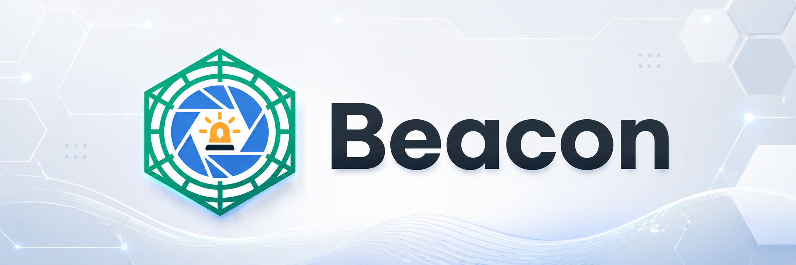
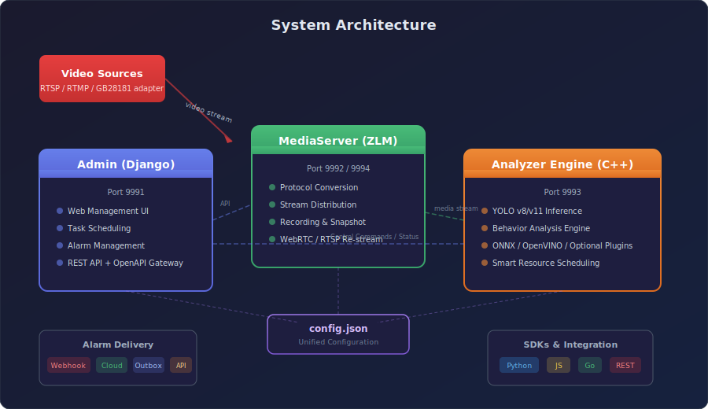
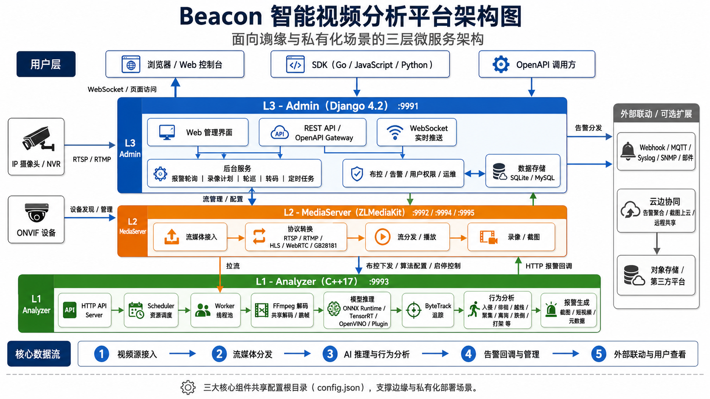

<div align="center">



# Beacon

**面向边缘与私有化场景的智能视频分析平台** — 集流媒体接入、算法推理、布控告警与运维管理于一体。

[](https://python.org)
[](https://www.djangoproject.com/)
[](https://isocpp.org)
[](#-部署方式)
[](LICENSE)
[](https://github.com/skygazer42/Beacon/actions/workflows/ci.yml)

[快速开始](#-快速开始) · [部署方式](#-部署方式) · [授权模式](#-授权模式) · [文档](#-文档) · [SDK](#-sdk)

</div>

## Beacon 是什么

Beacon 是一套可私有化部署的智能视频分析平台，由三个组件构成：

| 组件 | 技术栈 | 职责 |
|------|--------|------|
| **Admin** | Django | 管理后台、Web UI、OpenAPI、运维与配置入口 |
| **Analyzer** | C++ | 模型推理、行为分析与告警生成 |
| **MediaServer** | C++（ZLMediaKit 体系） | 流媒体接入、转发、播放与录制 |

四种典型用法，按你拿到的交付物形态选择：源码自编译全栈、二进制/DLL 私有化交付、Docker Cloud POC 快速体验，或只跑 `Admin/` 调试后台。

## ✨ 核心能力

- 📡 **接入与播放** — RTSP / RTMP 来源接入，按 MediaServer 能力提供 HLS / WebRTC 等播放与转发
- 🧠 **行为智能分析** — 入侵、徘徊、越线、聚集、离岗、跌倒、打架等
- 🎯 **布控闭环** — 视频与算法绑定、ROI/阈值配置、批量启停与分析日志
- 🔔 **告警工作流** — 截图/短视频取证、审核流转、Webhook / Cloud 投递
- 👤 **人脸向量库** — 向量录入、列表筛选、相似检索与分析联动
- ⚡ **可扩展推理后端** — ONNX Runtime / OpenVINO；TensorRT Engine 与 NPU 通过匹配的运行时或插件接入
- ☁️ **云边协同** — 边缘集群、远程共享、上级平台、云端告警聚合
- 🛠️ **管理运维** — 系统概览、诊断、审计、权限、API Key、升级与云边同步

> 仓库不包含模型权重或需要单独授权的硬件 SDK。管理与调度能力可直接使用；具体推理算法能否运行，取决于部署者提供的合法模型、推理运行时和硬件。

## 🏗️ 系统架构

<div align="center">

</div>

视频源经 MediaServer 接入分发，Analyzer 拉帧推理并生成告警，Admin 统一调度、下发布控并对外提供 Web/OpenAPI；三者共享根目录 `config.json`。

## 📐 架构图

<div align="center">


<br/><sub>产品关系示意图，不作为版本、数据库、协议或已交付算法的技术契约；当前实现以 <a href="docs/architecture/index.md">系统架构</a> 和上方 SVG 为准。</sub>
</div>

## 🚀 快速开始

最快的方式是用 Docker 起一套 **Cloud POC**，用于快速查看登录页与云端告警页面（仅演示 UI 与云端流程，不等同于正式 Edge 全栈交付）：

```bash
git clone https://github.com/skygazer42/Beacon.git
cd Beacon
cd deploy/cloud-saas-v1
cp .env.example .env
# 编辑 .env，替换所有 CHANGE_ME 占位值
docker compose up -d --build
```

启动后访问：

| 页面 | 地址 |
|------|------|
| 登录页 | http://localhost:9991/login |
| Cloud 告警页 | http://localhost:9991/cloud/alarms |

管理员用户名和密码由 `.env` 显式提供；生产模式不会生成默认密码。停止：`docker compose down`。

> 想跑通真实摄像头 + 算法 + 告警的完整链路？见 [部署方式](#-部署方式)。

## 📦 部署方式

首次获取 Beacon 后，先按「当前交付物形态」选择路线，避免混用不同部署命令。

| 路线 | 交付物形态 | 客户机器编译 | 适合场景 | 详细步骤 |
|------|-----------|:---:|---------|---------|
| **源码自编译** | Git/ZIP 源码 + 合法取得的 SDK/模型 | 是 | 开发联调、源码交付、硬件适配 | [Edge 全栈](docs/deploy/edge-full-stack.md) · [Linux 本机开发](docs/deployment/local-linux.md) |
| **二进制/DLL 交付** | 已编译产物 + 模型 + 授权 | 否 | 现场私有化、客户不参与编译 | [交付包规范](docs/deploy/delivery-layout.md) · [服务管理](docs/deploy/service-management.md) |
| **Docker Cloud POC** | 源码 + Docker | 仅构建镜像 | 快速看页面、云端流程演示 | [快速开始](#-快速开始) |
| **只启动 Admin** | `Admin/` 源码 | 否 | 后台页面 / API / 权限开发 | 见下方 |

**只启动 Admin**（不依赖完整视频分析链路，最适合后台开发）：

```bash
cd Admin
python3 -m venv venv && source venv/bin/activate        # Windows: venv\Scripts\activate
python -m pip install -r requirements-linux.txt         # Windows: requirements-windows.txt
python manage.py migrate --noinput
python manage.py createsuperuser                         # 新数据库首次启动必须创建账号
python manage.py runserver 0.0.0.0:9991                 # 访问 http://127.0.0.1:9991/login
```

关键目录与配置（`config.json`、`BEACON_ROOT_DIR`、`data/models`、`data/upload` 等）与各组件分步骤编译，见 **[部署总入口](docs/deploy/README.md)**。云端部署与边缘接入统一使用 [`deploy/cloud-saas-v1/`](deploy/cloud-saas-v1)；不再额外启动 10091 本地云实例。

## 🔑 授权模式

| 模式 | `licenseType` | 交付物 | 适合场景 |
|------|--------------|--------|---------|
| 社区版 | `community` | 无 | 开源默认，不启用运行授权门禁 |
| 机器码 | `machine` | 一个 `licenseKey` 字符串 | 单机、简单离线授权 |
| 加密锁 | `dongle` | 硬件锁 / 检测命令 / sentinel 文件 | 需要 USB/硬件锁控制 |
| 授权池·租约 | `pool` | 签名后的 `license.json` | 推荐商业交付，支持路数 / 节点 / 算法包限制 |

完整的发放、导入与验证流程（含 Ed25519 签名、`license.json` 结构、租约校验、常见报错）见 **[授权指南](docs/deploy/licensing.md)**。

## 🔌 默认端口

| 组件 | 端口 | 说明 |
|------|:---:|------|
| Admin | `9991` | Web 后台、Admin API、OpenAPI/Ops |
| MediaServer HTTP | `9992` | HTTP API、HLS、部分播放链路 |
| Analyzer | `9993` | 分析引擎 API |
| MediaServer RTSP | `9994` | RTSP 分发 |
| MediaServer RTMP | `9995` | RTMP 分发 |

端口与网络策略详见 [ports-and-firewall.md](docs/deploy/ports-and-firewall.md)。

## 📖 文档

| 主题 | 链接 |
|------|------|
| 部署总入口 | [docs/deploy/README.md](docs/deploy/README.md) |
| 配置参考 | [config-reference.md](docs/deploy/config-reference.md) |
| 授权发放 | [licensing.md](docs/deploy/licensing.md) |
| 安全加固 | [security-hardening.md](docs/deploy/security-hardening.md) |
| 故障排除 | [troubleshooting.md](docs/deploy/troubleshooting.md) |
| 页面与路由导览 | [guide/ui-pages.md](docs/guide/ui-pages.md) |
| 项目结构 | [developer/structure.md](docs/developer/structure.md) |
| 贡献说明 | [developer/contributing.md](docs/developer/contributing.md) |
| 更新日志 | [CHANGELOG.md](docs/CHANGELOG.md) |

## 🧩 SDK

面向二次开发与 OpenAPI 集成，提供三语言 SDK：
[Python](sdk/python/README.md) · [JavaScript](sdk/javascript/README.md) · [Go](sdk/go/README.md)

## 🗂️ 仓库结构

| 路径 | 用途 |
|------|------|
| [Admin/](Admin) | Django 管理后台：页面、API、权限、运维 |
| [Analyzer/](Analyzer) | C++ 分析引擎与模型推理 |
| [MediaServer/](MediaServer) | 流媒体接入与分发（ZLMediaKit 体系） |
| [sdk/](sdk) | Python / JavaScript / Go SDK |
| [deploy/](deploy) | Docker、Cloud POC、观测性与部署资源 |
| [docs/](docs) | 部署、运维、架构、变更记录 |
| [tests/](tests) | 集成与验收测试 |

## 🔒 安全提醒

- Cloud 和生产部署必须显式提供强管理员密码；不要复用文档中的演示值。
- 对外暴露时优先只开放 `9991`，并通过反向代理统一做 TLS、访问控制与审计。
- `9992` / `9993` 默认更适合内网或本机访问，公网暴露前应完成鉴权与加固。

详细策略见 [security-hardening.md](docs/deploy/security-hardening.md)。

## 📄 License

Beacon 自研代码使用 [MIT](LICENSE) 许可。`MediaServer/source/` 及其他引入代码保留各自的上游许可，其中 ZLMediaKit 还有必须保留品牌标识的补充条款。分发前请阅读 [第三方声明](THIRD_PARTY_NOTICES.md)。
