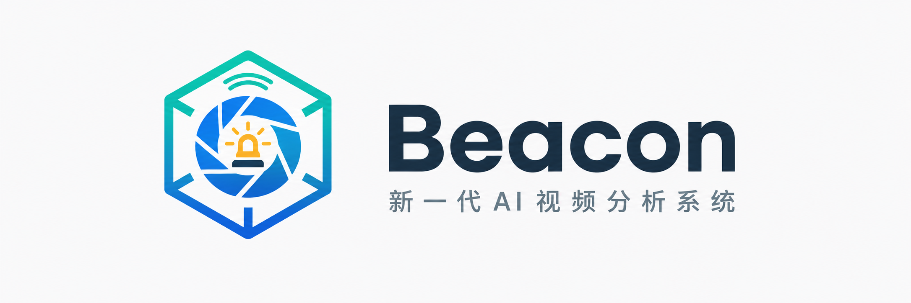
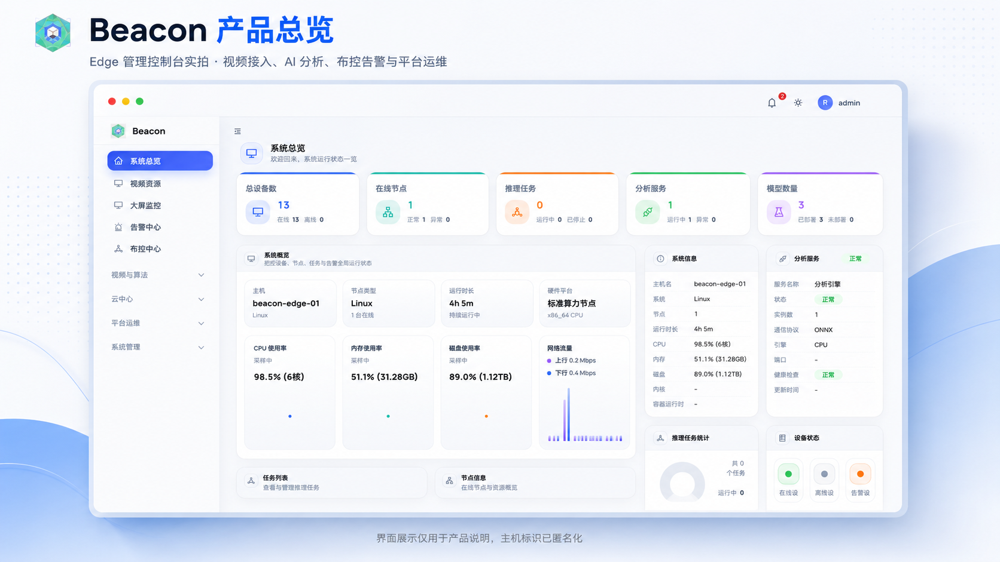
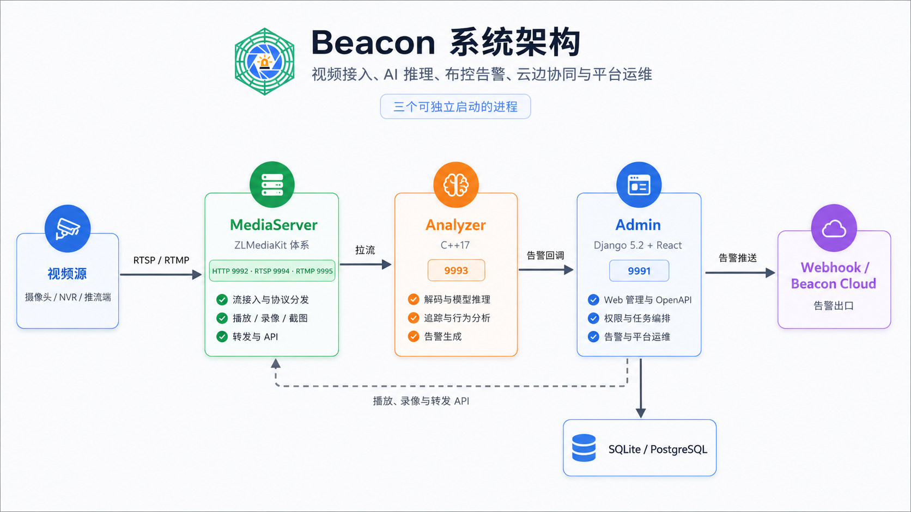

  

统一管理视频接入、AI 推理、布控告警、云边协同与平台运维，面向边缘和私有化部署。

  
  
  
  
  

  <a href="#快速开始">快速开始</a> ·
  <a href="#系统架构">系统架构</a> ·
  <a href="docs/deploy/README.md">部署文档</a> ·
  <a href="docs/api/index.md">API</a> ·
  <a href="#sdk">SDK</a>

## 产品预览

  

Edge 管理控制台界面示例；主机标识已匿名化，运行数据仅用于功能展示。

## 核心能力

| 能力 | 当前实现 |
|---|---|
| 视频接入与分发 | 管理 RTSP / RTMP 视频源，提供播放、转发、录像和截图链路 |
| AI 分析 | C++ 推理引擎，支持检测、追踪、行为规则和算法插件 |
| 布控与告警 | 绑定视频、算法、阈值与 ROI，完成启停、告警取证和处置闭环 |
| 云边协同 | Edge 接入 Beacon Cloud，上报告警并查看远程视频、录像和运行状态 |
| 开放集成 | OpenAPI、Webhook，以及 Python / JavaScript / Go SDK |
| 平台运维 | 运行概览、诊断、审计、权限、API Key、升级与许可证管理 |

## 系统架构

  

Beacon 由 Admin、MediaServer 和 Analyzer 三个独立进程组成。当前版本不以无状态微服务架构为部署目标。

| 组件 | 技术栈 | 默认端口 | 职责 |
|---|---|---:|---|
| **Admin** | Django 5.2 + React | <code>9991</code> | Web 管理、OpenAPI、权限、任务编排、告警与运维 |
| **MediaServer** | C++ / ZLMediaKit 体系 | <code>9992</code> / <code>9994</code> / <code>9995</code> | 流接入、协议分发、播放、录像与截图 |
| **Analyzer** | C++17 | <code>9993</code> | 解码、模型推理、追踪、行为分析与告警生成 |

典型数据链路如下：

    摄像头 / NVR / 推流端
            │ RTSP / RTMP
            ▼
    MediaServer ──拉流──▶ Analyzer ──告警回调──▶ Admin ──▶ Webhook / Beacon Cloud
            ▲                              │
            └────播放、录像与转发 API───────┘

实现边界和进程关系见 [系统架构说明](docs/architecture/index.md)。

## 快速开始

Beacon 的完整视频分析链路由 MediaServer、Analyzer 和 Admin 共同提供。以下流程适用于 Linux 源码部署；首次安装应先按 [Linux 本机开发](docs/deployment/local-linux.md) 准备系统依赖、ONNX Runtime、OpenVINO 和模型文件。

初始化 Admin 并构建两个 C++ 进程：

    git clone https://github.com/skygazer42/Beacon.git
    cd Beacon

    python3 -m venv Admin/venv
    source Admin/venv/bin/activate
    python -m pip install -r Admin/requirements-linux.txt
    python Admin/manage.py migrate --noinput
    python Admin/manage.py createsuperuser

    cmake -S MediaServer/source -B MediaServer/source/build -DCMAKE_BUILD_TYPE=Release
    cmake --build MediaServer/source/build -j
    bash tools/build_analyzer_local.sh

启动前应确认根目录 <code>config.json</code> 与 MediaServer 生成的 <code>config.ini</code> 使用相同的媒体密钥，并将 HTTP、RTSP、RTMP 端口分别配置为 <code>9992</code>、<code>9994</code>、<code>9995</code>。随后在三个终端中依次启动：

**终端 1：MediaServer**

    cd MediaServer/source/release/linux/Release
    ./MediaServer -c ./config.ini

**终端 2：Analyzer**

    bash tools/run_analyzer_local.sh

**终端 3：Admin**

    source Admin/venv/bin/activate
    python Admin/manage.py runserver 0.0.0.0:9991

验证三个进程：

    curl -sS -o /dev/null -w '%{http_code}\n' http://127.0.0.1:9991/login
    curl -sS "http://127.0.0.1:9992/index/api/getServerConfig?secret=<mediaSecret>" | head
    curl -sS http://127.0.0.1:9993/api/health

Admin 登录页应返回 HTTP <code>200</code>，MediaServer 应返回包含 <code>code: 0</code> 的配置数据，Analyzer 应返回包含 <code>code: 1000</code> 的健康状态。配置 <code>openApiToken</code> 后，Analyzer 健康检查还需携带 <code>X-Beacon-Token</code> 请求头。完整配置与摄像头验收流程见 [Edge 全栈部署](docs/deploy/edge-full-stack.md) 和 [端到端验收](docs/deploy/e2e-acceptance.md)。

## 部署选择

| 部署形态 | 运行内容 | 前置条件 | 文档 |
|---|---|---|---|
| Edge 源码部署 | Admin、MediaServer、Analyzer | 原生依赖、模型、匹配的推理运行时 | [Edge 全栈](docs/deploy/edge-full-stack.md) |
| 本机开发 | 按需启动三个进程 | Python、Node.js 和 C++ 构建环境 | [Linux](docs/deployment/local-linux.md) · [Windows](docs/deployment/local-windows.md) |
| 二进制私有化交付 | 已编译程序、配置、模型与授权 | 由交付方另行提供完整交付包 | [交付包规范](docs/deploy/delivery-layout.md) |
| Kubernetes 云端部署 | Beacon Cloud、PostgreSQL、MinIO | 自建应用镜像、镜像仓库、Secret 和持久化存储 | [Kubernetes](docs/deployment/kubernetes.md) |

生产环境应通过反向代理统一暴露 Admin。Analyzer、MediaServer、PostgreSQL 和 MinIO 应限制在受信网络。详见 [端口与防火墙](docs/deploy/ports-and-firewall.md)。

## 模型与硬件边界

仓库不包含模型权重、厂商 SDK 或需要单独授权的硬件运行时。Analyzer 提供 ONNX Runtime、OpenVINO 和算法插件接入路径；CUDA、TensorRT 和 NPU 能力取决于部署环境中的硬件、驱动、运行时及插件。

算法名称中的 <code>GPU</code>、<code>TRT</code> 或 <code>NPU</code> 为调度标识，不构成硬件可用性声明。

## SDK

仓库提供以下 OpenAPI 客户端：

- [Python SDK](sdk/python/README.md)
- [JavaScript SDK](sdk/javascript/README.md)
- [Go SDK](sdk/go/README.md)

## 文档导航

| 主题 | 文档 |
|---|---|
| 部署说明 | [部署总入口](docs/deploy/README.md) |
| 视频、布控与告警 | [使用指南](docs/guide/index.md) |
| API 与鉴权 | [API 文档](docs/api/index.md) |
| 配置项 | [配置参考](docs/deploy/config-reference.md) |
| 安全加固 | [安全指南](docs/deploy/security-hardening.md) |
| 运维与排障 | [运维手册](docs/deploy/ops-runbook.md) · [故障排除](docs/deploy/troubleshooting.md) |
| 页面清单 | [页面与路由导览](docs/guide/ui-pages.md) |
| 版本变化 | [更新日志](docs/CHANGELOG.md) |

## 仓库结构

| 路径 | 内容 |
|---|---|
| <code>Admin/</code> | Django 后端与 React 管理界面 |
| <code>Analyzer/</code> | C++ 视频分析引擎 |
| <code>MediaServer/</code> | 流媒体接入与分发 |
| <code>sdk/</code> | Python、JavaScript、Go SDK |
| <code>deploy/</code> | Docker Compose、Helm 与运维资源 |
| <code>docs/</code> | 架构、部署、使用和 API 文档 |

## 许可证

Beacon 自研代码采用 [MIT License](LICENSE)。<code>MediaServer/source/</code> 及其他第三方代码保留各自的上游许可和署名要求；分发前应阅读 [THIRD_PARTY_NOTICES.md](THIRD_PARTY_NOTICES.md)。
