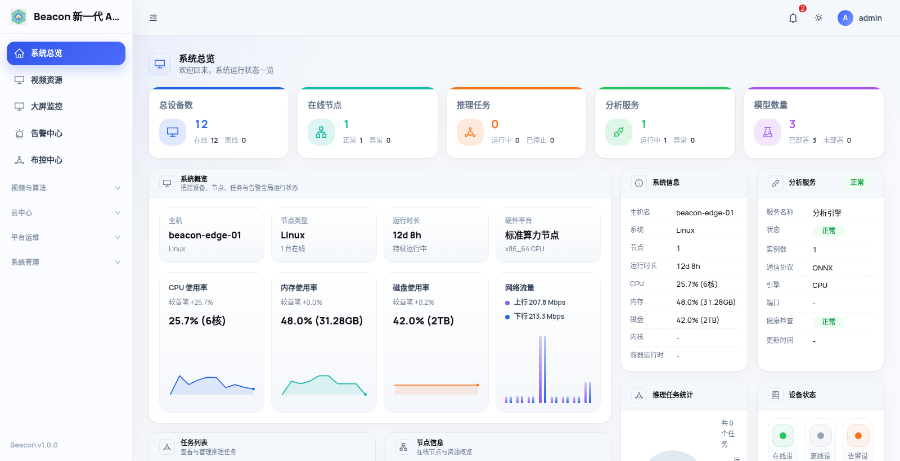

  

<h1 align="center">Beacon</h1>

<strong>新一代 AI 视频分析系统</strong>

统一管理视频接入、AI 推理、布控告警、云边协同与平台运维，面向边缘和私有化部署。

  
  
  
  
  

  <a href="#快速体验">快速体验</a> ·
  <a href="#系统架构">系统架构</a> ·
  <a href="docs/deploy/README.md">部署文档</a> ·
  <a href="docs/api/index.md">API</a> ·
  <a href="#sdk">SDK</a>

## 产品预览

  

Edge 管理控制台实拍；主机标识已匿名化，运行数据仅用于界面展示。

## 核心能力

| 能力 | 当前实现 |
|---|---|
| 视频接入与分发 | 管理 RTSP / RTMP 视频源，提供播放、转发、录像和截图链路 |
| AI 分析 | C++ 推理引擎，支持检测、追踪、行为规则和算法插件 |
| 布控与告警 | 绑定视频、算法、阈值与 ROI，完成启停、告警取证和处置闭环 |
| 云边协同 | Edge 接入 Beacon Cloud，上报告警并查看远程视频、录像和运行状态 |
| 开放集成 | OpenAPI、Webhook，以及 Python / JavaScript / Go SDK |
| 平台运维 | 运行概览、诊断、审计、权限、API Key、升级与许可证管理 |

## 系统架构

  

Beacon 是三个可独立启动的进程，不是无状态微服务集群：

| 组件 | 技术栈 | 默认端口 | 职责 |
|---|---|---:|---|
| **Admin** | Django 5.2 + React | <code>9991</code> | Web 管理、OpenAPI、权限、任务编排、告警与运维 |
| **MediaServer** | C++ / ZLMediaKit 体系 | <code>9992</code> / <code>9994</code> / <code>9995</code> | 流接入、协议分发、播放、录像与截图 |
| **Analyzer** | C++17 | <code>9993</code> | 解码、模型推理、追踪、行为分析与告警生成 |

一条完整链路：

    摄像头 / NVR / 推流端
            │ RTSP / RTMP
            ▼
    MediaServer ──拉流──▶ Analyzer ──告警回调──▶ Admin ──▶ Webhook / Beacon Cloud
            ▲                              │
            └────播放、录像与转发 API───────┘

实现边界和进程关系见 [系统架构说明](docs/architecture/index.md)。

## 快速体验

最快入口是 Docker Cloud POC，适合查看登录、云边接入和云端告警流程：

    git clone https://github.com/skygazer42/Beacon.git
    cd Beacon/deploy/cloud-saas-v1
    cp .env.example .env
    # 将 .env 中所有 CHANGE_ME 替换为你自己的强随机值
    docker compose up -d --build

浏览器打开 <code>http://localhost:9991/login</code>，账号由 <code>.env</code> 中的 bootstrap 配置创建。

> Cloud POC 不包含真实 MediaServer / Analyzer 推理链路。接入摄像头并运行模型，请使用 [Edge 全栈部署](docs/deploy/edge-full-stack.md)。

## 部署选择

| 场景 | 运行内容 | 文档 |
|---|---|---|
| 快速体验云端流程 | Admin + PostgreSQL + MinIO | [Cloud POC](docs/deploy/README.md) |
| 真实视频分析 | Admin + MediaServer + Analyzer | [Edge 全栈](docs/deploy/edge-full-stack.md) |
| 本机源码开发 | 按需启动三个进程 | [Linux](docs/deployment/local-linux.md) · [Windows](docs/deployment/local-windows.md) |
| 二进制私有化交付 | 已编译程序、配置、模型与授权 | [交付包规范](docs/deploy/delivery-layout.md) |
| Kubernetes 云端部署 | Beacon Cloud + PostgreSQL + MinIO | [Kubernetes](docs/deployment/kubernetes.md) |

默认只应对外开放 Admin <code>9991</code>；MediaServer 和 Analyzer 端口优先限制在本机或内网。详见 [端口与防火墙](docs/deploy/ports-and-firewall.md)。

## 模型与硬件边界

仓库不分发模型权重、厂商 SDK 或需要单独授权的硬件运行时。Analyzer 包含 ONNX Runtime、OpenVINO 和插件接入路径；CUDA、TensorRT、NPU 等能力取决于实际链接的运行时、插件和硬件。

算法名称中的 <code>GPU</code>、<code>TRT</code> 或 <code>NPU</code> 只表达选择意图，不代表当前机器已经具备对应算力。

## SDK

面向 OpenAPI 集成提供三种客户端：

- [Python SDK](sdk/python/README.md)
- [JavaScript SDK](sdk/javascript/README.md)
- [Go SDK](sdk/go/README.md)

## 文档导航

| 主题 | 文档 |
|---|---|
| 从零部署 | [部署总入口](docs/deploy/README.md) |
| 视频、布控与告警 | [使用指南](docs/guide/index.md) |
| API 与鉴权 | [API 文档](docs/api/index.md) |
| 配置项 | [配置参考](docs/deploy/config-reference.md) |
| 安全加固 | [安全指南](docs/deploy/security-hardening.md) |
| 运维与排障 | [运维手册](docs/deploy/ops-runbook.md) · [故障排除](docs/deploy/troubleshooting.md) |
| 页面清单 | [页面与路由导览](docs/guide/ui-pages.md) |
| 版本变化 | [更新日志](docs/CHANGELOG.md) |

## 仓库结构

| 路径 | 内容 |
|---|---|
| <code>Admin/</code> | Django 后端与 React 管理界面 |
| <code>Analyzer/</code> | C++ 视频分析引擎 |
| <code>MediaServer/</code> | 流媒体接入与分发 |
| <code>sdk/</code> | Python、JavaScript、Go SDK |
| <code>deploy/</code> | Docker Compose、Helm 与运维资源 |
| <code>docs/</code> | 架构、部署、使用和 API 文档 |

## License

Beacon 自研代码使用 [MIT License](LICENSE)。<code>MediaServer/source/</code> 和其他引入代码保留各自的上游许可与署名；分发前请阅读 [THIRD_PARTY_NOTICES.md](THIRD_PARTY_NOTICES.md)。
