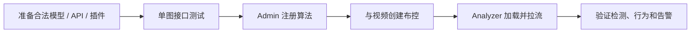

# 算法与模型

Beacon 提供算法编排、若干推理实现、行为后处理和插件接口，但仓库不分发模型权重或厂商运行时。开源源码能编译通过，不等于某个业务算法已达到可交付精度。

## 接入路径

| 路径 | 适用情况 | 关键限制 |
|---|---|---|
| 本地模型 | ONNX 或 OpenVINO 模型与 Analyzer 输出布局匹配 | 需合法模型、运行时和单图/视频验证 |
| TensorRT Engine | 已为目标 GPU/版本生成 Engine | 必须提供 TensorRT 插件和匹配运行时 |
| Compat / Plugin | 厂商 NPU、专有 SDK 或自定义推理 | 仓库 Compat 是接口/stub，真实后端由集成方提供 |
| 外部 HTTP API | 算法运行在独立服务 | 每帧 JPEG/Base64 有带宽和延迟成本，需配置超时/熔断 |
| Pipeline | 检测、分类、特征、追踪等多阶段组合 | 配置必须与当前 Pipeline mode 实现一致 |

## 生命周期

上传模型只是保存文件和元数据。上线前至少核对：

- 模型格式、输入尺寸/布局和输出张量布局；
- 类别列表、置信度/NMS 和前后处理；
- 实际 Provider、精度和硬件运行时；
- ROI、线段、计划和行为持续时间；
- 真实视频上的误报、漏报、P99 延迟和资源占用。

## 源码中“内置”的含义

- `AlgorithmBuiltinCatalog.cpp` 是已知模型编码和预期文件名目录，不包含权重。
- Behavior API v2 有一组本地规则后处理，仍依赖外部 API 返回检测结果和正确配置。
- Pipeline/行为节点是代码能力，不是跨场景精度保证。

不要把算法定义列表、页面选项或 `GPU`/`NPU` 后缀当作模型已经部署。

## 文档入口

- [本地规则与模型目录](builtin.md)
- [模型格式](models.md)
- [Pipeline](pipeline.md)
- [插件 SDK](plugin-sdk.md)
- [故障排查](troubleshooting.md)
- [算法 API 协议 v2](../integration/algorithm-api-protocol-v2.md)
