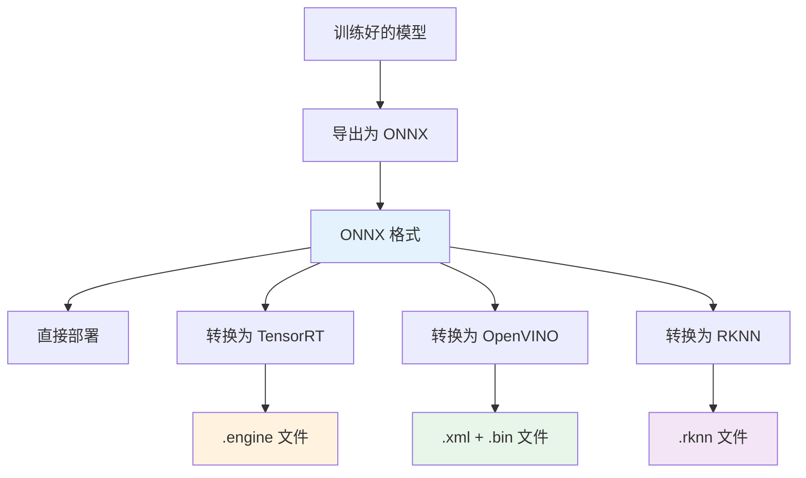

# 模型格式指南

Beacon Analyzer 支持多种主流深度学习模型格式，通过模型文件后缀自动路由到对应的推理后端。本文档介绍各格式的要求、转换方法和优化技巧。

## 支持的模型格式

| 格式 | 文件后缀 | 推理后端 | 硬件支持 | 适用场景 |
|------|----------|----------|----------|----------|
| ONNX | `.onnx` | ONNX Runtime | CPU / CUDA / TensorRT EP | 通用首选，跨平台兼容 |
| TensorRT | `.engine` / `.plan` | Beacon 插件加载 | NVIDIA GPU | 需匹配的 Engine、插件和 TensorRT/CUDA |
| OpenVINO IR | `.xml` + `.bin` | OpenVINO Runtime | 以实际设备枚举为准 | 需匹配架构的 OpenVINO/TBB 运行时 |
| RKNN | `.rknn` | Compat Plugin | 以外部插件为准 | 仓库不含 RKNN 后端或厂商 SDK |
| 昇腾 OM | `.om` | Compat Plugin | 以外部插件为准 | 仓库不含 Ascend 后端或厂商 SDK |



---

## ONNX 模型

ONNX（Open Neural Network Exchange）是通用模型格式。请求设备为 `AUTO` 时，当前实现依次尝试 TensorRT EP、CUDA EP，最后使用 CPU；这只是代码顺序，不代表 TensorRT 对每个模型都更快。显式请求 `CUDA` 或 `TENSORRT` 而 Provider 初始化失败时，模型加载会失败。

### 输入张量要求

| 属性 | 要求 |
|------|------|
| 名称 | `images`（推荐）或任意名称（自动检测） |
| 形状 | `[1, 3, H, W]`（NCHW 格式） |
| 数据类型 | `float32` |
| 颜色空间 | RGB（Analyzer 内部自动处理 BGR -> RGB 转换） |
| 归一化 | `0.0 - 1.0`（像素值 / 255.0） |
| 常用分辨率 | `640x640`、`416x416`、`320x320` |

### 输出张量要求（YOLO 格式）

Beacon 内置了 YOLO 系列输出格式的自动解析（`YoloOutputLayout`），支持以下布局：

=== "YOLOv5 / YOLOv7 格式"

    ```
    输出形状: [1, num_boxes, 5 + num_classes]
    每行格式: [x_center, y_center, width, height, obj_conf, cls_0, cls_1, ..., cls_n]
    ```

    - `obj_conf`：目标存在置信度
    - `cls_i`：各类别的条件概率
    - 最终置信度 = `obj_conf * max(cls_i)`

=== "YOLOv8 / YOLOv11 格式"

    ```
    输出形状: [1, 4 + num_classes, num_boxes]  (需转置)
    每列格式: [x_center, y_center, width, height, cls_0, cls_1, ..., cls_n]
    ```

    - 无单独的 `obj_conf`，类别分数直接作为置信度
    - 最终置信度 = `max(cls_i)`

=== "自定义格式"

    Beacon 的 `YoloOutputLayout` 解析器支持自动检测以下变体：

    ```
    3D: [1, dim, rows]      -- dim-first（需转置）
    3D: [1, rows, dim]      -- rows-first
    4D: [1, 1, rows, dim]   -- 带 batch 维
    4D: [1, anchors, rows, dim]  -- 多 anchor
    ```

    通过 `classCount` 参数辅助判断 `dim` 是 `4+classes` 还是 `5+classes`。

### 模型导出示例

=== "PyTorch (YOLOv8)"

    ```python
    from ultralytics import YOLO

    model = YOLO("yolov8n.pt")
    model.export(
        format="onnx",
        imgsz=640,
        simplify=True,
        opset=17,
        dynamic=False,  # Beacon 推荐静态 shape
    )
    ```

=== "PyTorch (通用)"

    ```python
    import torch

    model = MyDetectionModel()
    model.load_state_dict(torch.load("model.pth"))
    model.eval()

    dummy_input = torch.randn(1, 3, 640, 640)
    torch.onnx.export(
        model,
        dummy_input,
        "model.onnx",
        opset_version=17,
        input_names=["images"],
        output_names=["output0"],
        dynamic_axes=None,  # 静态 shape
    )
    ```

=== "PaddlePaddle"

    ```bash
    # 使用 Paddle2ONNX
    paddle2onnx \
        --model_dir ./inference_model \
        --model_filename model.pdmodel \
        --params_filename model.pdiparams \
        --save_file model.onnx \
        --opset_version 17
    ```

### ONNX 模型验证

上传前建议使用以下脚本验证模型格式：

```python
import onnxruntime as ort
import numpy as np

sess = ort.InferenceSession("model.onnx")

# 检查输入
for inp in sess.get_inputs():
    print(f"输入: {inp.name}, 形状: {inp.shape}, 类型: {inp.type}")

# 检查输出
for out in sess.get_outputs():
    print(f"输出: {out.name}, 形状: {out.shape}, 类型: {out.type}")

# 测试推理
dummy = np.random.randn(1, 3, 640, 640).astype(np.float32)
results = sess.run(None, {sess.get_inputs()[0].name: dummy})
for i, r in enumerate(results):
    print(f"输出[{i}] 形状: {r.shape}")
```

---

## TensorRT Engine

TensorRT 可能提高特定 NVIDIA GPU/模型的推理性能。Beacon 通过插件动态库加载 `.engine` 文件，收益必须实测。

!!! warning "重要提示"
    TensorRT engine 文件与 **GPU 型号**和 **TensorRT 版本**强绑定，不可跨设备/版本使用。每台部署机器需要单独构建 engine。

### Engine 构建方法

=== "trtexec 命令行"

    ```bash
    # FP16 精度（推荐）
    trtexec \
        --onnx=model.onnx \
        --saveEngine=model.engine \
        --fp16 \
        --workspace=4096 \
        --minShapes=images:1x3x640x640 \
        --optShapes=images:1x3x640x640 \
        --maxShapes=images:1x3x640x640

    # INT8 精度（需要校准数据集）
    trtexec \
        --onnx=model.onnx \
        --saveEngine=model_int8.engine \
        --int8 \
        --calib=calibration_cache.bin \
        --workspace=4096
    ```

=== "Python API"

    ```python
    import tensorrt as trt

    logger = trt.Logger(trt.Logger.WARNING)
    builder = trt.Builder(logger)
    network = builder.create_network(
        1 << int(trt.NetworkDefinitionCreationFlag.EXPLICIT_BATCH)
    )
    parser = trt.OnnxParser(network, logger)

    with open("model.onnx", "rb") as f:
        parser.parse(f.read())

    config = builder.create_builder_config()
    config.set_memory_pool_limit(trt.MemoryPoolType.WORKSPACE, 4 << 30)
    config.set_flag(trt.BuilderFlag.FP16)

    engine = builder.build_serialized_network(network, config)
    with open("model.engine", "wb") as f:
        f.write(engine)
    ```

### Beacon 配置

在 `config.json` 中指定 TensorRT 插件路径：

```json
{
  "tensorrtEnginePluginPath": "/opt/beacon/plugins/libtrt_engine_plugin.so"
}
```

---

## OpenVINO IR

OpenVINO IR（Intermediate Representation）是 Intel 硬件上的最优推理格式，由 `.xml`（模型结构）和 `.bin`（权重）两个文件组成。

### 模型转换

=== "从 ONNX 转换"

    ```bash
    # OpenVINO Model Optimizer
    mo \
        --input_model model.onnx \
        --output_dir ./openvino_model \
        --data_type FP16 \
        --input_shape "[1,3,640,640]" \
        --mean_values "[0,0,0]" \
        --scale_values "[255,255,255]"

    # OpenVINO 2023+ 推荐使用 ovc
    ovc model.onnx \
        --output_model openvino_model/model.xml
    ```

=== "从 PyTorch 转换"

    ```python
    import openvino as ov
    import torch

    model = MyModel()
    model.load_state_dict(torch.load("model.pth"))
    model.eval()

    # 方法一：通过 ONNX 中转
    dummy = torch.randn(1, 3, 640, 640)
    ov_model = ov.convert_model(model, example_input=dummy)
    ov.save_model(ov_model, "model.xml", compress_to_fp16=True)
    ```

### 文件放置

OpenVINO 模型需要 `.xml` 和 `.bin` 两个文件放在同一目录下：

```
models/
  ov_yolov8n_80/
    model.xml      # 模型结构
    model.bin      # 模型权重
```

Beacon 加载时通过 `.xml` 文件路径自动关联对应的 `.bin` 文件。

---

## 模型目录结构

所有模型文件放在 Analyzer 的模型目录下（通过 `config.json` 的 `Analyzer.modelDir` 配置，默认为 `./models`）：

```
models/
├── on_yolov8n_80/              # ONNX 通用检测模型
│   └── yolov8n.onnx
├── ov_yolov8n_80/              # OpenVINO 通用检测模型
│   ├── yolov8n.xml
│   └── yolov8n.bin
├── ov_yolov8n_fire_smoke/      # OpenVINO 烟火检测模型
│   ├── fire_smoke.xml
│   └── fire_smoke.bin
├── ov_yolov8n_fight_nofight/   # OpenVINO 打架检测模型
│   ├── fight.xml
│   └── fight.bin
├── trt_yolov8n_80/             # TensorRT 通用检测模型
│   └── yolov8n.engine
├── custom/                     # 用户自定义模型
│   ├── helmet_detect/
│   │   └── helmet.onnx
│   └── forklift_detect/
│       └── forklift.onnx
└── plugins/                    # 插件动态库
    ├── libmy_algorithm.so
    └── libmy_algorithm.dll
```

### 命名规范

内置模型的算法编码遵循以下命名规范：

```
{引擎前缀}_{模型架构}_{数据集/功能}
```

| 引擎前缀 | 含义 |
|----------|------|
| `on_` | ONNX Runtime |
| `ov_` | OpenVINO |
| `trt_` | TensorRT |

示例：`ov_yolov8n_80` = OpenVINO + YOLOv8-nano + COCO 80 类

---

## 模型加密

Beacon 支持对模型文件进行 AES-256 加密，防止模型被盗用：

### 加密流程

```bash
# 使用 Beacon 提供的工具加密模型
beacon-model-encrypt \
    --input model.onnx \
    --output model.onnx.enc \
    --key-file /etc/beacon/model.key
```

### 配置解密

在 `config.json` 中配置解密密钥路径：

```jsonc
{
  "modelEncrypt": true,
  "modelEncryptKey": "replace-with-your-key",
  "modelDecryptDir": "/opt/beacon/data/upload/.model_cache"
}
```

Analyzer 会识别配置的加密后缀或文件头，但当前实现会把解密后的明文模型写入 `modelDecryptDir/<algorithm>/` 再交给推理运行时。该目录必须位于受控文件系统，限制权限、纳入清理策略，并按明文模型资产保护；不要把该功能描述成纯内存解密。

---

## 硬件优化建议

### NVIDIA GPU

| 优化项 | 建议 |
|--------|------|
| 精度 | FP16/INT8 必须在目标数据集上与 FP32 基线对比，不假设固定收益或精度损失 |
| 格式 | 分别测试 TensorRT engine、TRT EP 与 CUDA EP；最优选择取决于模型算子与版本兼容性 |
| Batch | 只在调度和延迟目标允许时增加，同时观察队列与尾延迟 |
| 显存 | 以加载和峰值实测为准，为引擎构建、解码和系统预留余量 |
| 驱动 | 使用 ONNX Runtime/TensorRT 官方兼容矩阵对应的驱动、CUDA、cuDNN 与 TensorRT 版本 |

### Intel 平台

| 优化项 | 建议 |
|--------|------|
| 精度 | 根据目标设备支持和校准结果选择 FP32/FP16/INT8 |
| 格式 | 对 ONNX Runtime 与 OpenVINO IR 分别做正确性和性能测试 |
| 线程 | 使用目标 OpenVINO 版本支持的配置方式，并观察与解码线程的竞争 |
| 设备 | 以 Analyzer 返回的 `openvinoDevices` 和实际加载日志为准 |
| Runtime | 与构建链接版本和目标系统架构保持一致 |

### ARM / 国产 AI 芯片

| 平台 | 格式 | 说明 |
|------|------|------|
| 瑞芯微 RK3588 | `.rknn` | 通过 Compat Plugin（`libbeacon_compat.so`） |
| 华为昇腾 310/910 | `.om` | 通过 Compat Plugin |
| 其他平台 | 插件 SDK | 开发自定义推理插件 |

Compat Plugin 的配置：

```json
{
  "compatLibPath": "/opt/beacon/lib/libbeacon_compat.so"
}
```

也可通过环境变量指定外部硬件后端插件：

```bash
export BEACON_COMPAT_BACKEND_PATH=/opt/beacon/compat/libbeacon_rknn_backend.so
```

这里的 `BEACON_COMPAT_BACKEND_PATH` 必须指向实现了 `BeaconGetAlgorithmPluginV3` 接口的 Beacon 兼容后端插件，不能直接指向 `librknn_api.so`、`libascendcl.so` 这类厂商基础运行库。

运行 Analyzer 核心测试，确认 compat shim 的 `stub` / `delegated` 行为：

```bash
bash tools/run_analyzer_unit_tests.sh
```

---

## 常见问题

### 模型输出格式不匹配

如果自定义模型的输出格式不是标准 YOLO 布局，Analyzer 的 `YoloOutputLayout` 解析器可能无法自动识别。解决方法：

1. 调整模型导出参数使输出符合标准 YOLO 格式
2. 使用 [插件 SDK v2](plugin-sdk.md) 封装自定义后处理逻辑
3. 在算法配置中指定 `classCount` 帮助解析器区分输出维度

### ONNX Runtime Provider 降级

请求设备为 `AUTO` 时，Analyzer 按以下顺序尝试 ONNX Runtime Execution Provider：

```
TensorRT EP → CUDA EP → CPU EP
```

如果自动模式下 GPU Provider 不可用，会使用 CPU。显式请求 CUDA/TensorRT 时不会静默降级；可通过日志确认当前使用的 Provider：

```
[INFO] ONNX Runtime: using CUDAExecutionProvider
```

### TensorRT Engine 加载失败

常见原因：

1. engine 文件与当前 GPU 不匹配 — 需在目标 GPU 上重新构建
2. TensorRT 版本不一致 — engine 文件需匹配当前安装的 TensorRT 版本
3. 插件路径配置错误 — 检查 `tensorrtEnginePluginPath` 是否指向正确的动态库
