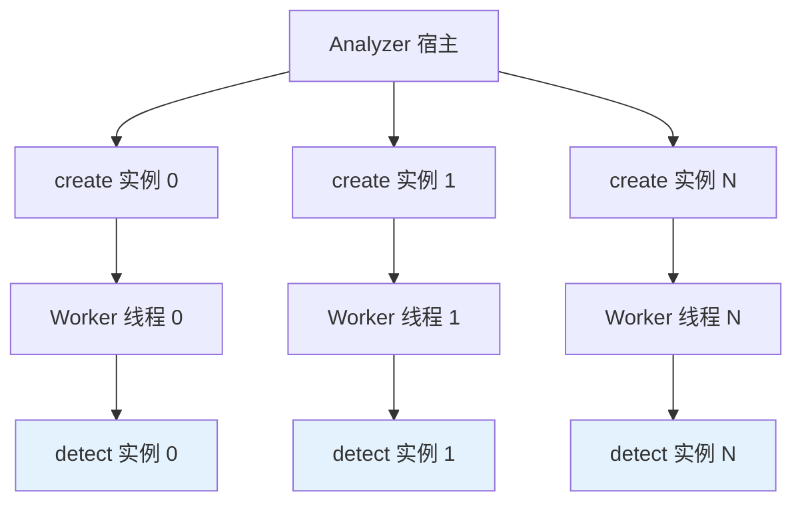

# 插件 SDK v2 开发指南

Beacon 插件 SDK v2 提供了一套**稳定的 C ABI 接口**，允许第三方开发者以动态库（`.so` / `.dll` / `.dylib`）的形式集成自定义算法到 Beacon Analyzer 中。

!!! tip "需要协议规范?"
    本页是 **开发指南**(为什么用、怎么写、怎么编、怎么联调)。
    如需 **协议契约层面的字段定义、ABI、错误码** 速查,请直接看 [插件 SDK v2 协议规范](../integration/algorithm-plugin-sdk-v2.md)。

## 为什么选择 Plugin SDK v2

### C ABI vs C++ ABI 的问题

直接暴露 C++ 接口作为插件 ABI 存在严重的兼容性问题：

| 问题 | C++ ABI | C ABI (SDK v2) |
|------|---------|----------------|
| 编译器版本 | 插件必须与宿主使用完全相同的编译器版本 | 任意 C/C++ 编译器均可 |
| STL 实现 | `std::string`、`std::vector` 跨 DLL 传递不安全 | 只使用 `int32_t`、`float`、`const char*` 等 POD 类型 |
| 名称修饰 | C++ name mangling 因编译器而异 | `extern "C"` 确保符号名称统一 |
| 类布局 | 虚函数表布局可能不同 | 函数指针表，布局明确 |
| 跨平台 | 几乎不可移植 | Windows / Linux / macOS 通用 |

**SDK v2 的设计原则**：只通过 C 语言原始类型和函数指针跨越 DLL 边界，确保插件在任意编译环境下都能正确加载和调用。

---

## 核心数据结构

所有结构体定义在 `PluginSdkV2.h` 头文件中。

### BeaconPluginImageV2 — 输入图像

```c
typedef struct BeaconPluginImageV2 {
    const unsigned char* bgr;   // 像素数据指针（BGR 格式，8-bit）
    int32_t width;              // 图像宽度（像素）
    int32_t height;             // 图像高度（像素）
    int32_t stride;             // 行步长（字节/行）
} BeaconPluginImageV2;
```

!!! info "关于图像格式"
    - 颜色空间：**BGR**，与 OpenCV 的 `CV_8UC3` 一致
    - `stride` 可能大于 `width * 3`（行对齐），遍历像素时需使用 stride
    - 像素访问：`pixel[y][x] = bgr + y * stride + x * 3`
    - 数据由宿主（Analyzer）管理，插件不应释放此指针

### BeaconPluginDetectV2 — 检测结果

```c
typedef struct BeaconPluginDetectV2 {
    int32_t x1;                 // 边界框左上角 X
    int32_t y1;                 // 边界框左上角 Y
    int32_t x2;                 // 边界框右下角 X
    int32_t y2;                 // 边界框右下角 Y
    float score;                // 置信度 (0.0 ~ 1.0)
    int32_t class_id;           // 类别 ID
    const char* class_name;     // 类别名称（UTF-8，可为 NULL）
} BeaconPluginDetectV2;
```

!!! warning "class_name 内存管理"
    - `class_name` 指向的字符串必须在下一次 `detect()` 调用前保持有效
    - 推荐做法：使用实例内部的静态字符串或持久缓冲区
    - 如果不需要类别名称，设置为 `NULL`，宿主会根据 `class_id` 查找

### BeaconAlgorithmPluginV2 — 函数表

```c
typedef struct BeaconAlgorithmPluginV2 {
    uint32_t abi_version;       // 必须为 BEACON_PLUGIN_SDK_V2_ABI_VERSION (= 2)
    const char* plugin_name;    // 插件名称（可选，用于日志）

    // 创建推理实例
    BeaconPluginInstanceV2 (*create)(
        const char* algorithm_code,
        const char* model_path
    );

    // 销毁推理实例
    void (*destroy)(BeaconPluginInstanceV2 instance);

    // 执行推理
    // 返回值: >= 0 = 检测数量; < 0 = 错误
    int32_t (*detect)(
        BeaconPluginInstanceV2 instance,
        const BeaconPluginImageV2* image,
        float conf_thresh,
        float nms_thresh,
        BeaconPluginDetectV2* out_dets,
        int32_t max_dets
    );
} BeaconAlgorithmPluginV2;
```

---

## 导出符号

插件必须导出以下 C 符号：

```c
const BeaconAlgorithmPluginV2* BeaconGetAlgorithmPluginV2();
```

Analyzer 加载插件 DLL 后，通过 `dlsym` / `GetProcAddress` 查找此符号来获取函数表。

---

## 函数表详解

### create — 创建推理实例

```c
BeaconPluginInstanceV2 (*create)(
    const char* algorithm_code,  // 算法编码（如 "my_helmet_detect"）
    const char* model_path       // 模型文件绝对路径（可为 NULL）
);
```

- Analyzer 会为每个并发槽调用一次 `create()`，创建多个独立实例
- 在此函数中初始化模型、分配 GPU 资源等
- 返回 `NULL` 表示创建失败

### destroy — 销毁推理实例

```c
void (*destroy)(BeaconPluginInstanceV2 instance);
```

- Analyzer 关闭时对每个实例调用
- 释放模型资源、GPU 显存等

### detect — 执行推理

```c
int32_t (*detect)(
    BeaconPluginInstanceV2 instance,
    const BeaconPluginImageV2* image,    // 输入图像
    float conf_thresh,                    // 置信度阈值
    float nms_thresh,                     // NMS 阈值
    BeaconPluginDetectV2* out_dets,      // 输出缓冲区（由宿主分配）
    int32_t max_dets                      // 缓冲区最大容量
);
```

**返回值**:

- `>= 0`：成功，返回写入 `out_dets` 的检测框数量（不超过 `max_dets`）
- `< 0`：错误

**调用约定**:

- 输出缓冲区 `out_dets` 由 Analyzer 宿主分配，插件只需填充
- 如果检测结果超过 `max_dets`，截断到 `max_dets`（按置信度排序保留 top-K）

---

## 线程安全

Analyzer 对插件实例的调用遵循以下并发模型：



**关键规则**:

1. **每个实例有独立的互斥锁**：Analyzer 使用 round-robin 策略分配请求，并通过 per-instance mutex 保证同一实例不会被并发调用
2. **不要使用全局状态**：不同实例可能被不同线程同时调用，避免使用全局变量
3. **create/destroy 是串行调用的**：所有实例在初始化阶段串行创建，在关闭阶段串行销毁
4. **detect 调用可以并发**：多个实例的 `detect` 可能同时被不同线程调用

**推荐做法**:

```c
// 好的做法：所有状态封装在实例内部
struct MyInstance {
    void* model_handle;
    float* workspace;
    char class_name_buf[256];
};

// 避免的做法：
static float* g_workspace;  // 全局状态，线程不安全！
```

---

## 完整示例

以下是一个完整的 SDK v2 插件示例，实现了一个简单的颜色检测算法：

```c
// my_color_detector.c
#include "PluginSdkV2.h"
#include <stdlib.h>
#include <string.h>
#include <stdio.h>

// ========== 实例结构 ==========
typedef struct MyColorDetectorInstance {
    int target_r, target_g, target_b;
    int tolerance;
    char class_name_buf[64];
} MyColorDetectorInstance;

// ========== create ==========
static BeaconPluginInstanceV2 my_create(
    const char* algorithm_code,
    const char* model_path
) {
    (void)model_path;  // 此示例不需要模型文件

    MyColorDetectorInstance* inst = calloc(1, sizeof(MyColorDetectorInstance));
    if (!inst) return NULL;

    // 根据算法编码配置检测目标颜色
    if (strcmp(algorithm_code, "detect_red") == 0) {
        inst->target_r = 200; inst->target_g = 50; inst->target_b = 50;
        snprintf(inst->class_name_buf, sizeof(inst->class_name_buf), "red_object");
    } else {
        inst->target_r = 50; inst->target_g = 50; inst->target_b = 200;
        snprintf(inst->class_name_buf, sizeof(inst->class_name_buf), "blue_object");
    }
    inst->tolerance = 80;

    printf("[MyColorDetector] create instance for '%s'\n", algorithm_code);
    return (BeaconPluginInstanceV2)inst;
}

// ========== destroy ==========
static void my_destroy(BeaconPluginInstanceV2 instance) {
    free((void*)instance);
}

// ========== detect ==========
static int32_t my_detect(
    BeaconPluginInstanceV2 instance,
    const BeaconPluginImageV2* image,
    float conf_thresh,
    float nms_thresh,
    BeaconPluginDetectV2* out_dets,
    int32_t max_dets
) {
    (void)nms_thresh;
    MyColorDetectorInstance* inst = (MyColorDetectorInstance*)instance;
    int32_t count = 0;

    // 简化示例：网格扫描查找匹配颜色的区域
    const int grid = 64;
    for (int gy = 0; gy < image->height && count < max_dets; gy += grid) {
        for (int gx = 0; gx < image->width && count < max_dets; gx += grid) {
            // 采样中心像素 (BGR 格式)
            int cx = gx + grid / 2;
            int cy = gy + grid / 2;
            if (cx >= image->width || cy >= image->height) continue;

            const unsigned char* px = image->bgr + cy * image->stride + cx * 3;
            int b = px[0], g = px[1], r = px[2];

            int dr = abs(r - inst->target_r);
            int dg = abs(g - inst->target_g);
            int db = abs(b - inst->target_b);

            if (dr < inst->tolerance && dg < inst->tolerance && db < inst->tolerance) {
                float score = 1.0f - (dr + dg + db) / (3.0f * inst->tolerance);
                if (score >= conf_thresh) {
                    out_dets[count].x1 = gx;
                    out_dets[count].y1 = gy;
                    out_dets[count].x2 = gx + grid < image->width ? gx + grid : image->width;
                    out_dets[count].y2 = gy + grid < image->height ? gy + grid : image->height;
                    out_dets[count].score = score;
                    out_dets[count].class_id = 0;
                    out_dets[count].class_name = inst->class_name_buf;
                    count++;
                }
            }
        }
    }

    return count;
}

// ========== 函数表（静态全局） ==========
static const BeaconAlgorithmPluginV2 g_plugin = {
    .abi_version = BEACON_PLUGIN_SDK_V2_ABI_VERSION,
    .plugin_name = "MyColorDetector",
    .create      = my_create,
    .destroy     = my_destroy,
    .detect      = my_detect,
};

// ========== 导出符号 ==========
#ifdef _WIN32
__declspec(dllexport)
#else
__attribute__((visibility("default")))
#endif
const BeaconAlgorithmPluginV2* BeaconGetAlgorithmPluginV2(void) {
    return &g_plugin;
}
```

---

## 构建指南

### CMake 构建示例

```cmake
cmake_minimum_required(VERSION 3.16)
project(my_color_detector LANGUAGES C)

# 插件头文件路径
set(BEACON_SDK_INCLUDE_DIR "${CMAKE_CURRENT_SOURCE_DIR}/include")

add_library(my_color_detector SHARED
    src/my_color_detector.c
)

target_include_directories(my_color_detector PRIVATE
    ${BEACON_SDK_INCLUDE_DIR}
)

# 确保导出符号可见
if(UNIX)
    target_compile_options(my_color_detector PRIVATE -fvisibility=hidden)
    target_link_options(my_color_detector PRIVATE -Wl,--no-undefined)
endif()

# 输出名称不带 lib 前缀（可选）
set_target_properties(my_color_detector PROPERTIES
    PREFIX ""
    C_STANDARD 11
)
```

### 构建命令

=== "Linux"

    ```bash
    mkdir build && cd build
    cmake .. -DCMAKE_BUILD_TYPE=Release
    cmake --build .
    # 产物: my_color_detector.so
    ```

=== "Windows (MSVC)"

    ```powershell
    mkdir build; cd build
    cmake .. -G "Visual Studio 17 2022" -A x64
    cmake --build . --config Release
    # 产物: my_color_detector.dll
    ```

=== "macOS"

    ```bash
    mkdir build && cd build
    cmake .. -DCMAKE_BUILD_TYPE=Release
    cmake --build .
    # 产物: my_color_detector.dylib
    ```

---

## 部署与注册

### 1. 放置插件文件

将编译好的动态库复制到 Analyzer 的模型目录下：

```
models/
└── plugins/
    └── my_color_detector.so
```

### 2. 注册算法

在 Admin 管理后台「算法管理」中创建算法记录：

| 字段 | 值 |
|------|-----|
| 算法编码 | `detect_red` |
| 算法名称 | 红色物体检测 |
| 模型路径 | `plugins/my_color_detector.so` |
| 目标列表 | `red_object` |

### 3. 创建布控

将注册的算法绑定到视频流通道，设置检测区域和告警规则。

---

## 测试与调试

### 符号验证

确认插件正确导出了所需符号：

```bash
# Linux
nm -D my_color_detector.so | grep Beacon
# 期望输出: T BeaconGetAlgorithmPluginV2

# macOS
nm my_color_detector.dylib | grep Beacon

# Windows
dumpbin /exports my_color_detector.dll | findstr Beacon
```

### 独立测试

编写独立的测试程序验证插件功能：

```c
// test_plugin.c
#include "PluginSdkV2.h"
#include <stdio.h>
#include <dlfcn.h>  // Linux; Windows 用 LoadLibrary

int main() {
    // 加载插件
    void* lib = dlopen("./my_color_detector.so", RTLD_NOW);
    if (!lib) {
        fprintf(stderr, "dlopen failed: %s\n", dlerror());
        return 1;
    }

    // 获取函数表
    BeaconGetAlgorithmPluginV2Fn getPlugin =
        (BeaconGetAlgorithmPluginV2Fn)dlsym(lib, "BeaconGetAlgorithmPluginV2");
    if (!getPlugin) {
        fprintf(stderr, "symbol not found\n");
        return 1;
    }

    const BeaconAlgorithmPluginV2* plugin = getPlugin();
    printf("Plugin: %s, ABI: %u\n", plugin->plugin_name, plugin->abi_version);

    // 创建实例
    BeaconPluginInstanceV2 inst = plugin->create("detect_red", NULL);
    if (!inst) {
        fprintf(stderr, "create failed\n");
        return 1;
    }

    // 构造测试图像 (100x100 红色)
    unsigned char image_data[100 * 100 * 3];
    for (int i = 0; i < 100 * 100; i++) {
        image_data[i * 3 + 0] = 50;   // B
        image_data[i * 3 + 1] = 30;   // G
        image_data[i * 3 + 2] = 220;  // R
    }

    BeaconPluginImageV2 image = {
        .bgr = image_data,
        .width = 100,
        .height = 100,
        .stride = 300
    };

    // 执行检测
    BeaconPluginDetectV2 dets[64];
    int32_t n = plugin->detect(inst, &image, 0.5f, 0.4f, dets, 64);
    printf("Detections: %d\n", n);
    for (int i = 0; i < n; i++) {
        printf("  [%d] (%d,%d)-(%d,%d) score=%.2f class=%s\n",
               i, dets[i].x1, dets[i].y1, dets[i].x2, dets[i].y2,
               dets[i].score, dets[i].class_name ? dets[i].class_name : "N/A");
    }

    // 销毁实例
    plugin->destroy(inst);
    dlclose(lib);

    printf("Test passed!\n");
    return 0;
}
```

### 常见调试问题

| 问题 | 原因 | 解决方法 |
|------|------|----------|
| `dlopen` 失败 | 缺少依赖库 | `ldd my_plugin.so` 检查依赖 |
| 符号未找到 | 缺少 `extern "C"` 或符号未导出 | 检查 `nm -D` 输出 |
| ABI 版本不匹配 | `abi_version` 字段值错误 | 确保使用 `BEACON_PLUGIN_SDK_V2_ABI_VERSION` |
| 段错误（SIGSEGV） | 访问了已释放的内存 | 检查 `class_name` 生命周期 |
| detect 返回负数 | 插件内部错误 | 在插件中添加日志排查 |
| 并发崩溃 | 使用了全局可变状态 | 将所有状态放入实例结构体 |

---

## SDK 版本对照

| 版本 | ABI 版本号 | 特性 | 状态 |
|------|-----------|------|------|
| Legacy | — | C++ ABI，需相同编译器 | 兼容维护 |
| SDK v2 | `2` | 稳定 C ABI，函数指针表 | **推荐** |
| SDK v3 | `3` | v2 + 姿态关键点输出 | 新增 |

Analyzer 加载插件时按优先级尝试：**v3 -> v2 -> Legacy**，自动选择最高可用版本。

!!! tip "从 Legacy 迁移到 SDK v2"
    已有 C++ 算法实现时，只需编写一个 C 包装层：

    1. 在 `create()` 中 `new` 你的 C++ 算法对象
    2. 在 `detect()` 中调用 C++ 对象的推理方法，将结果转写到 `out_dets`
    3. 在 `destroy()` 中 `delete` 对象
    4. 用 `extern "C"` 导出 `BeaconGetAlgorithmPluginV2`
