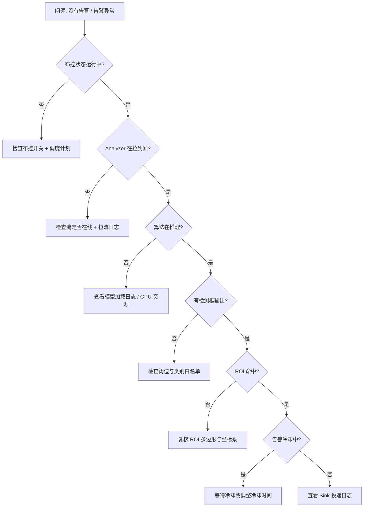

# 算法故障排查

本页汇总 Beacon Analyzer 在 **算法加载、推理、行为判定、告警生成** 四个阶段最容易出现的问题,按"现象 → 排查 → 处置"的格式给出可操作的步骤。
入门排查请先回 [运维故障排除](../operations/troubleshooting.md);本页聚焦 **与算法/模型相关** 的问题。

---

## 一图看清排查路径

---

## 一、模型加载阶段

### 1.1 现象: Analyzer 启动后立即退出,日志含 `model load failed`

排查:

| 检查项 | 命令 / 入口 |
|--------|-------------|
| 模型路径是否存在 | `ls -la <Analyzer.modelDir>/<model_path>` |
| 文件后缀与配置匹配 | 后缀决定推理后端(`.onnx` / `.engine` / `.xml`) |
| 推理 Provider 库是否就位 | `ldd Analyzer/build/Analyzer \| grep -E "onnx\|trt\|openvino"` |
| GPU 模型是否需要相同 CUDA 版本 | `nvidia-smi` + `nvcc --version` |

处置:

- 重新上传模型,确保文件名与算法配置一致
- 如缺少 ONNX Runtime CUDA Provider,改用 CPU Provider 临时跑通,再补 GPU 依赖
- TRT engine 必须由 **目标 GPU 同型号 + 同 TRT 版本** 转出,跨机器迁移多半要重新转 engine

### 1.2 现象: 启动正常但首次推理报 `cudaErrorInvalidValue`

- 多半是 CUDA driver / runtime / TRT 三者版本错配
- `nvidia-smi` 中的 driver version 至少要 ≥ TRT 与 CUDA Toolkit 文档要求

---

## 二、推理阶段

### 2.1 现象: 流在线但没有任何检测框

排查顺序:

1. 看 Analyzer 日志中是否有 `infer cost xx ms` 或类似的逐帧日志
2. 在「算法管理 → 算法测试」上传一张包含目标的图片,直接验算法本身
3. 临时把 `confThresh` 调到 `0.05`,确认是否阈值过严
4. 确认 `modelClassNames` 与 `detectClassNames` 没有打错(大小写、英文逗号)

### 2.2 现象: GPU 利用率长期 100%,告警延迟大

可能原因:

- `modelConcurrency` 配得太高,显存抖动反而拖累
- 输入分辨率过大(1080P 直接送 1080P 模型推理)
- 模型本身没有量化(FP32 跑大模型)

处置:

- 把 `modelConcurrency` 降到 1–2,观察单实例吞吐
- 在 `algorithmParams.inputWidth/inputHeight` 内显式指定 `640 × 640`
- 改用 FP16 / INT8 模型,详见 [模型格式](models.md)

### 2.3 现象: 报 `CUDA out of memory`

- 多算法 + 多并发会叠加,实战部署前先做 **峰值显存测算**
- 优先降 `modelConcurrency`,再考虑切换到更小模型
- 多 GPU 节点推荐按卡拆分实例或节点,不要把所有算法和视频流堆到同一张 GPU

---

## 三、行为判定阶段

### 3.1 现象: 检测框正常但 `happen=false`,无告警

排查:

| 行为类型 | 关键参数 | 易错点 |
|----------|----------|--------|
| 入侵 | ROI 多边形 | 坐标比例 vs 像素混淆 |
| 徘徊 | 持续时长阈值 | 默认值过大,实测时人很快走过 |
| 越线 | 计数线方向 | 方向反了导致永远不告警 |
| 跌倒 | 关键点置信度 | 模型不是姿态模型,关键点缺失 |

处置:

- 在 ROI 内画一个明显大的多边形,直接走人验证
- 把行为时长阈值临时降到 `1s`,确认逻辑通了再调大
- 越线方向先用 `bidirectional` 验证,再定方向

### 3.2 现象: 偶发告警风暴

- 抓取一段告警,看 `controlCode + algorithmCode` 是否集中在某条流
- 该流是否最近有镜头抖动 / 光照剧变 → 提高 `confThresh` 或加冷却
- 尝试为该布控开启 **行为去抖**(同一目标多帧确认)

---

## 四、告警生成与推送

### 4.1 现象: 告警在「告警管理」可见,但外部接不到

- 看 [告警事件总线](../integration/alarm-bus.md) 中各 Sink 的状态
- Webhook: 外部 URL 是否返回 2xx;签名 secret 是否一致
- Cloud: Edge Token 是否有效，Cloud 端点是否可达
- Outbox 重试: 检查 `alarmOutboxEnabled` 是否为 `true`

### 4.2 现象: 截图丢失或裂图

- 截图写盘失败通常源于 **磁盘满 / 权限错** —— 检查 `runs/` 目录可写性
- 裂图通常是 JPEG 编码线程被杀,关注 GPU/CPU 高水位告警

---

## 五、性能基线与回归

每次升级 / 换模型后,跑一遍最小性能基线:

| 工具 | 用途 |
|------|------|
| `tools/run_analyzer_unit_tests.sh` | 单测回归 |
| 直接调用 `/open/algorithm/audioDetect` | ASR API 接入验活（见 [算法 API 协议 v2](../integration/algorithm-api-protocol-v2.md)） |
| 「算法测试」页面 | 上传图片验单帧推理 |
| Grafana 看板 | 帧延迟 / GPU 利用率趋势对比 |

更系统的性能优化方法见 [性能调优](../operations/performance.md)。

---

## 何时去看 Analyzer 源码

满足以下条件之一时,才需要进入 Analyzer 源码定位:

- 现象只在特定模型 / 特定 GPU 复现
- 文档与配置都对,但行为与预期相反
- 怀疑是 Analyzer 内部的 ByteTrack / 行为模块逻辑问题

入口建议:

- `Analyzer/Analyzer/Core/` — 推理后端、Pipeline 调度
- `Analyzer/Analyzer/Behavior/` — 行为判定算法
- 单测目录配合最小复现样本调试

更进一步参考 [Analyzer 架构文档](../architecture/analyzer.md)。
