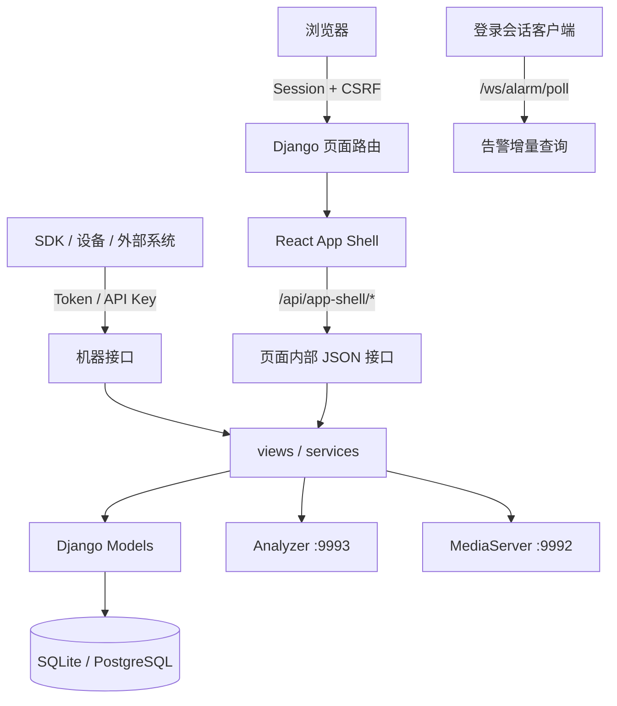
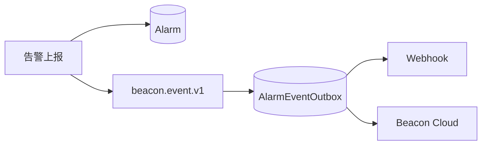

# Admin 架构

Admin 是 Beacon 的管理与编排进程，使用 Django 5.2 LTS、React 和 Vite，默认监听 `9991`。Django 负责认证、权限、数据持久化和对外接口；React 负责登录后的业务页面。

## 请求边界



Admin 暴露四类接口：

| 类型 | 路径示例 | 认证方式 | 用途 |
|---|---|---|---|
| 页面与 App Shell | `/stream/index`、`/api/app-shell/streams` | Django 登录会话；写操作同时受 CSRF 保护 | React 页面内部调用，不作为长期稳定的第三方契约 |
| 机器 OpenAPI | `/open/*`、`/stream/open*`、`/control/open*` | `X-Beacon-Token` / API Key，作用域 `openapi` | SDK、Analyzer、边缘节点及工业系统接入 |
| 运维接口 | `/healthz`、`/readyz`、`/metrics`、`/open/ops/*` | Token / API Key，作用域 `ops` | 健康检查、指标和受控运维动作 |
| Cloud / 数字人运行时 | `/open/cloud/v1/*`、`/open/agent/*` | 各自的 Edge Token 或运行时认证协议 | 云边告警和数字人采集端接入 |

仓库当前没有通用的“登录换 JWT，再访问所有 Admin API”协议。OIDC 中的 JWT 仅用于验证身份提供方回调；数字人 JWT 也只适用于数字人运行时接口。

## WebSocket

原生 ASGI 端点只有：

```text
ws://<host>:9991/ws/alarm/poll?after_id=0&interval_ms=3000
```

- 只接受有效的 Django Session Cookie，不接受 API Key 或通用 JWT。
- 首次连接发送一份 `alarm.poll` 摘要，之后仅在存在新增告警时发送。
- `interval_ms` 会限制在 250–10000 ms。
- 客户端可发送 `{"after_id": 123}` 更新游标；没有自定义订阅或心跳协议。
- React 告警页当前仍使用 HTTP 轮询，因此部署 WSGI 时页面可用；需要该 WebSocket 时必须用 ASGI 服务并正确配置反向代理。

## 后台服务

`app.utils.BackgroundServices` 在 Django 应用启动时管理以下进程内任务：

| 类型 | 当前组件 |
|---|---|
| 常驻服务 | Webhook/Cloud 告警投递、Outbox、转码管理、录像计划、任务计划 |
| 后台线程 | 告警缓存/留存清理、录像留存、日志留存、存储配额、自动转发、布控自动恢复 |

设置 `BEACON_DISABLE_BACKGROUND=1` 可整体关闭。因为这些任务不是独立 worker，部署时只能运行一个会启动后台服务的 Django 进程；Cloud 参考镜像已经固定一个 Gunicorn worker。

## 告警投递



当前只保留 Webhook 和 Cloud 两类外部 Sink。Outbox 提供至少一次投递；接收端必须使用 `event_id` 去重。网络错误、HTTP 429 和 5xx 会按 2、4、8、16、32、60 秒上限继续重试；其他 4xx 记为永久失败。

## 数据与敏感字段

默认数据库为 SQLite；设置 `BEACON_CLOUD_DB_URL=postgresql://...` 后使用 PostgreSQL。MySQL 当前不受支持。

API Key 只保存加 pepper 的 SHA-256 哈希和可见前缀。部分业务集成字段（例如 TOTP seed、ONVIF 密码、Cloud Edge Token、数字人代理 Token/密码及外部 AI Key）目前仍由数据库直接保存；生产部署应限制数据库和备份访问，并在需要更高保护等级时增加 KMS/字段级加密。

## 目录结构

```text
Admin/
├── app/
│   ├── models.py              # 数据模型
│   ├── middleware.py          # 会话、OpenAPI、审计和安全策略
│   ├── views/                 # 页面、App Shell 与机器接口
│   ├── services/              # 数字人等业务服务
│   ├── utils/                 # Analyzer/MediaServer 客户端和后台服务
│   └── tests/                 # 核心 Django 测试
├── framework/                 # settings、URL、WSGI/ASGI
├── frontend/                  # React/Vite 源码
├── static/app-shell/          # 构建后的前端资源
├── templates/app/             # React 壳、登录和启动数据模板
└── manage.py
```

## 相关文档

- [API 概览](../api/index.md)
- [认证边界](../api/authentication.md)
- [Webhook](../integration/webhook.md)
- [安全加固](../deploy/security-hardening.md)
