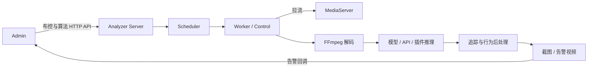

# Analyzer 架构

Analyzer 是 C++17 进程，负责媒体解码、模型/插件推理、追踪与行为后处理、告警媒体生成，并通过 HTTP 与 Admin 协作。默认监听 `9993`。

## 运行链路

主要源码入口：

| 模块 | 职责 |
|---|---|
| `Server.cpp` | libevent HTTP 路由和鉴权 |
| `Scheduler.cpp` | 布控、算法实例和资源状态 |
| `Worker.cpp` | 单个布控的媒体与分析循环 |
| `Analyzer.cpp` | Pipeline 模式、推理和行为处理 |
| `Algorithm*.cpp` | ONNX、OpenVINO、OCR、ReID 和插件加载 |
| `AvPullStream.cpp` / `AvPushStream.cpp` | FFmpeg 媒体输入/输出 |
| `GenerateAlarmVideo.cpp` | 告警媒体合成 |

## HTTP 接口

`Server.cpp` 当前注册：

- `/api/health`、`/api/controls`、`/api/control*`
- `/api/algorithm/list|load|unload|testInfer`
- `/api/face/list|add|delete|search|enable|disable`
- `/api/license/info`、`/api/device/info`
- `/api/resource/info|setmax`、`/api/scheduler/info`
- `/metrics` 和 `/api/metrics`

这些是 Analyzer 内部/运维协议，不等同于 Admin 的 OpenAPI。配置 Token 后调用方必须按 Analyzer 接受的 Bearer 或 `X-Beacon-Token` 方式传递；不要把 `9993` 暴露公网。

## 推理后端

| 路径 | 代码支持 | 部署者必须提供 |
|---|---|---|
| ONNX | `AlgorithmOnYolo`、`AlgorithmOnReid` | 匹配的 ONNX Runtime、合法模型及正确输入输出布局 |
| OpenVINO | `AlgorithmOvYolo`、`AlgorithmOvReid` | 对应架构的 OpenVINO/TBB 运行时和 IR 模型 |
| TensorRT Engine | 识别 `.engine` / `.plan` 并委托插件 | TensorRT/CUDA、匹配 GPU 的 Engine 和 `tensorrtEnginePluginPath` |
| NPU/厂商后端 | Compat/Plugin ABI | 厂商 SDK、运行时和实际后端插件；仓库内 Compat 默认为 stub |
| 外部 HTTP | Behavior/API 推理协议 | 可达的服务、超时/熔断参数和响应契约 |

算法编码的 CPU/GPU/TRT/NPU 后缀只表达选择意图。使用 `forceInferenceDevice` 时不可用后端会拒绝加载；未强制时可能降级，必须检查有效设备和日志。

## 模型目录元数据

`AlgorithmBuiltinCatalog.cpp` 记录若干已知算法编码、预期文件名和类别，用于识别部署包中的模型。仓库不提交这些模型文件；目录元数据不是“内置模型可直接运行”的承诺。

模型上传后还必须通过单图测试，并核对类别、输出布局、阈值、输入尺寸、精度和 Provider。

## 追踪与行为

`ByteTrack.cpp` 使用卡尔曼状态预测、ByteTrack 风格的高/低置信度两阶段关联，以及 IoU 贪心匹配。它不是上游 ByteTrack 的逐行移植，也没有使用 Hungarian 求解器。

Behavior API v2 的本地后处理支持 `intrusion`、`super`、`motion`、`occlusion`、`grayscreen`、`corruptscreen`、`crowd`、`crossing`、`crosscount`、`loitering`、`absence` 和 `unattended`。其中多项需要 ROI、线段、视频尺寸、追踪或持续时间配置。

模型能输出检测框不代表行为规则已经验证；每种场景都应以标注视频测试误报、漏报和时延。

## 插件 ABI

Analyzer 按顺序尝试：

1. `BeaconGetAlgorithmPluginV3`（稳定 C ABI，含姿态关键点）；
2. `BeaconGetAlgorithmPluginV2`（稳定 C ABI）；
3. 旧的 C++ `Algorithm*` ABI，仅为兼容保留。

开源示例位于 `examples/algorithm_plugin_cpp/`，展示 v2 函数表。实际插件仍需在目标编译器、运行库、并发和异常场景下验收；旧 C++ ABI 不应作为跨工具链稳定契约。

## 并发和扩展边界

Analyzer 包含共享解码、算法实例复用、队列上限、检测步长和资源状态代码，但这些机制不构成自动集群调度。`maxControls`、并发、共享解码和 GPU/NPU 路数必须在真实环境测试。

CI 的 Analyzer core tests 只编译和执行不依赖完整推理运行时的一组核心单元测试；它不加载模型或验证摄像头/GPU 链路。

## 相关文档

- [模型格式](../algorithms/models.md)
- [算法与后处理](../algorithms/builtin.md)
- [算法 API 协议](../integration/algorithm-api-protocol-v2.md)
- [插件 ABI](../integration/algorithm-plugin-sdk-v2.md)
- [端到端验收](../deploy/e2e-acceptance.md)
