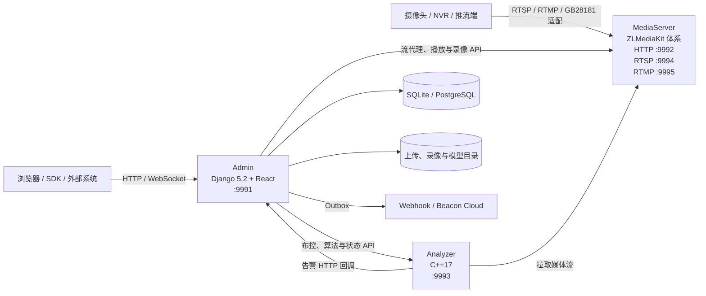

# 系统架构概览

Beacon 由三个可独立启动的进程组成：Admin、MediaServer 和 Analyzer。它们按职责拆分，但会共享 `config.json`、模型目录和上传目录，因此当前更准确的描述是“三进程架构”，不是可任意横向扩容的无状态微服务系统。

## 组件关系

| 组件 | 当前职责 | 主要边界 |
|---|---|---|
| Admin | 登录与权限、React 管理界面、OpenAPI、布控编排、告警入库、录像/任务计划、云边控制台 | 不负责视频编解码或模型推理 |
| MediaServer | 拉流代理、协议分发、播放、录像、截图和可选转推 | 基于仓库内的 ZLMediaKit 分支，许可和上游来源见 `MediaServer/UPSTREAM.md` |
| Analyzer | 解码、检测、追踪、行为分析、告警媒体生成和算法插件加载 | 仓库不分发模型权重、厂商 SDK 或完整硬件运行时 |

## 运行链路

1. Admin 保存视频源，并调用 MediaServer 建立拉流代理或接收主动推流。
2. 用户创建布控，将视频流、算法、阈值和识别区域绑定在一起。
3. Admin 通过 Analyzer HTTP API启动布控；Analyzer 从 MediaServer 拉取流并执行推理。
4. Analyzer 通过 Admin 的告警接口上报结果及媒体路径/内容。
5. Admin 写入告警和 Outbox；启用后由后台线程投递到 Webhook 或 Beacon Cloud。
6. React 页面通过登录会话调用 `/api/app-shell/*`。告警页面当前使用 HTTP 轮询；另有仅支持登录会话的 `/ws/alarm/poll` WebSocket 端点。

## 推理后端边界

Analyzer 源码包含 ONNX Runtime、OpenVINO 和插件加载路径。CUDA/TensorRT 是否可用取决于所链接的 ONNX Runtime Provider；`.engine` / `.plan`、RKNN、Ascend 等格式依赖部署者提供的合法插件和厂商运行时。算法编码中的 `GPU`、`TRT` 或 `NPU` 后缀只表达选择意图，不保证当前机器具备对应能力。

追踪实现采用 ByteTrack 风格的两阶段关联，并使用卡尔曼预测与 IoU 贪心匹配；它不是上游 ByteTrack 仓库的逐行移植。

## 部署形态

| 形态 | 内容 | 限制 |
|---|---|---|
| Edge 全栈 | Admin + MediaServer + Analyzer | 需要自行准备模型、推理运行时和媒体依赖 |
| Cloud POC | Admin + PostgreSQL + MinIO | 用于验证云端登录、边缘接入与告警聚合，不包含真实 Analyzer/MediaServer 链路 |
| Admin 开发 | 只启动 Django/React 生产包 | 可开发页面和管理 API，视频及推理动作会依赖外部服务 |

Admin 的后台任务当前在 Django 进程内启动。Cloud 参考部署因此固定为一个 Gunicorn worker 和一个副本；在拆出独立 worker 之前，不应直接增加 Web worker 或 Kubernetes 副本，否则可能重复执行计划、清理和 Outbox 投递。

## 进一步阅读

- [Admin 架构](admin.md)
- [Analyzer 架构](analyzer.md)
- [MediaServer 架构](mediaserver.md)
- [部署总入口](../deploy/README.md)
- [页面与路由导览](../guide/ui-pages.md)
