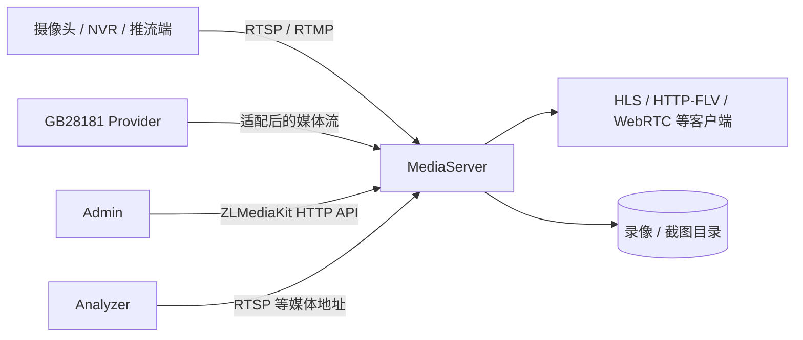

# MediaServer 架构

Beacon 的 MediaServer 基于仓库内维护的 ZLMediaKit 分支，负责媒体拉流代理、主动推流接收、协议分发、播放、录像和截图。上游基线、本地差异和嵌套依赖见 `MediaServer/UPSTREAM.md`。

## 进程边界

MediaServer 不负责用户权限、布控规则或模型推理。Admin 通过 `Admin/app/utils/ZLMediaKit.py` 和流相关服务调用其 HTTP API；Analyzer 使用 Admin 下发的媒体地址拉流。

## 端口与协议

根目录安全默认配置为：

| 配置项 | 默认值 | 用途 |
|---|---:|---|
| `mediaHttpPort` | 9992 | HTTP API、静态/HLS/HTTP-FLV 等 |
| `mediaRtspPort` | 9994 | RTSP 服务 |
| `mediaRtmpPort` | 9995 | RTMP 服务 |

启动器会根据 `config.json` 改写 MediaServer 运行配置，所以源码模板里的 `80`、`554`、`1935` 不是 Beacon 的最终默认端口。WebRTC、RTP、SRT、TLS 和附加协议是否可用取决于编译选项、最终配置和网络/NAT 条件。

RTSP、RTMP、HLS、HTTP-FLV 与 WebRTC 是不同的接入或播放形式。容器/二进制能启动，不代表每种协议都已在目标网络验收。

## 流生命周期

1. Admin 保存来源地址或等待外部推流。
2. 启动转发时，Admin 调用 MediaServer 建立拉流代理。
3. MediaServer 注册媒体流并按启用的协议提供播放地址。
4. Analyzer 从指定地址拉取流；浏览器从 Admin 返回的候选播放地址中选择可用形式。
5. 停止代理或来源断开后，状态由 MediaServer API 和 Admin 再次查询更新。

数据库中的“在线”“转发中”是查询时状态，不是永久事实。必须结合 MediaServer 日志、媒体 API 和实际播放器确认。

## 录像与截图

Admin 可调用 MediaServer 的录制、截图和流代理 API，并在数据库保存录像计划/文件索引。实际文件路径受工作目录、MediaServer 配置和 Admin 上传/录像目录影响。

生产环境应明确：

- 录像格式、切片、保留周期和磁盘配额；
- 运行账号对目录的最小权限；
- 告警截图/视频与常规录像的备份、隐私和删除策略；
- 磁盘耗尽时的降级和告警方式。

## 安全边界

- 设置随机 `mediaSecret`，只允许 Admin 所在网络访问敏感 MediaServer API。
- 不把 MediaServer HTTP、RTSP、RTMP 管理面直接暴露公网。
- 摄像头凭据可能出现在来源 URL、数据库和日志中；限制日志/诊断包访问并制定轮换方案。
- 使用 TLS/RTSPS/RTMPS/WebRTC 时，需要单独配置证书和验证完整客户端链路。

## 构建与许可

CI 只构建一个关闭测试、播放器、API/C++ API、WebRTC 和 SRT 的最小 MediaServer target，用于证明核心源码可编译；它不证明完整功能组合均已构建。

分发 MediaServer 前阅读 `MediaServer/UPSTREAM.md`、`THIRD_PARTY_NOTICES.md` 以及源码内许可证，并保留上游要求的版权和品牌标识。
