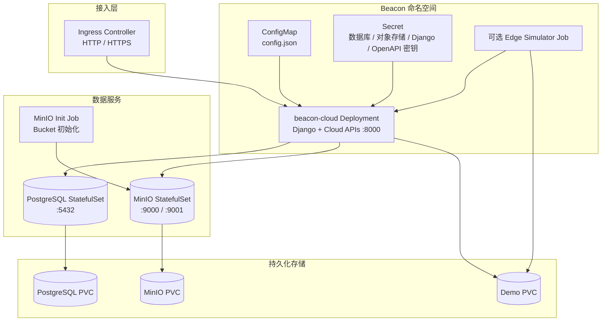

# Kubernetes 部署指南

本文档说明 Beacon Cloud SaaS v1 在 Kubernetes 集群中的 Helm 部署方式。当前仓库提供的 Chart 面向云端控制台场景，核心工作负载包括 `beacon-cloud` Web 服务、PostgreSQL、MinIO、初始化 Job，以及可选的边缘模拟 Job。

!!! note "部署边界"

    Kubernetes 部署使用容器镜像、Helm values、Kubernetes Secret / ConfigMap 和持久化卷，不接受 Windows EXE 或 DLL 作为 Pod 运行材料。

---

## 1. 前置条件

| 组件 | 最低版本 | 说明 |
|------|---------|------|
| Kubernetes | 1.24+ | 集群版本 |
| Helm | 3.10+ | Kubernetes 包管理器 |
| kubectl | 与集群版本匹配 | 集群管理工具 |
| 持久化存储 | -- | StorageClass，例如 local-path、NFS、Ceph 或云盘 |

### 可选组件

| 组件 | 用途 |
|------|------|
| Ingress Controller | Nginx Ingress / Traefik，提供外部 HTTP(S) 入口 |
| cert-manager | TLS 证书自动签发与续期 |
| Prometheus + Grafana | 集群和业务服务监控 |
| Loki / EFK | 容器日志聚合 |
| External Secrets Operator / Sealed Secrets | 生产环境密钥管理 |

---

## 2. Helm Chart 概览

Beacon Cloud SaaS v1 Helm Chart 位于 `deploy/cloud-saas-v1/chart/` 目录。

```text
deploy/cloud-saas-v1/chart/
├── Chart.yaml
├── values.yaml
└── templates/
    ├── _helpers.tpl
    ├── beacon-cloud-deployment.yaml
    ├── configmap.yaml
    ├── edge-simulator-job.yaml
    ├── ingress.yaml
    ├── minio-init-job.yaml
    ├── minio-statefulset.yaml
    ├── postgres-statefulset.yaml
    ├── pvc.yaml
    ├── secret.yaml
    ├── serviceaccount.yaml
    ├── services.yaml
    └── tests/
        └── test-connection.yaml
```

### 部署架构



当前 Chart 不包含独立的 MediaServer、Analyzer 或边缘侧运行时工作负载。边缘节点运行在各自站点，通过 Cloud 控制台创建的集群令牌接入本 Chart 部署的云端服务。

---

## 3. 快速部署

### 3.1 准备 values 文件

```bash title="复制并编辑 values 文件"
cp deploy/cloud-saas-v1/chart/values.yaml deploy/cloud-saas-v1/chart/my-values.yaml
vim deploy/cloud-saas-v1/chart/my-values.yaml
```

生产环境必须至少设置以下值：

```yaml title="my-values.yaml - 生产必填项"
beaconCloud:
  secrets:
    openApiToken: "设置强随机字符串"
    djangoSecretKey: "设置强随机字符串"
    edgeTokenPepper: "设置强随机字符串"
    bootstrapAdminUsername: admin
    bootstrapAdminPassword: "设置强管理员密码"

postgres:
  auth:
    password: "设置强随机字符串"

minio:
  rootUser: beacon-minio
  rootPassword: "设置强随机字符串"
```

随机密钥可通过以下命令生成：

```bash title="生成随机密钥"
python3 -c "import secrets; print(secrets.token_urlsafe(48))"
```

### 3.2 安装 Chart

```bash title="使用 Helm 安装"
kubectl create namespace beacon

helm install beacon-cloud ./deploy/cloud-saas-v1/chart/ \
  -n beacon \
  -f deploy/cloud-saas-v1/chart/my-values.yaml

kubectl -n beacon get pods -w
```

### 3.3 验证部署

```bash title="验证 Kubernetes 资源"
kubectl -n beacon get all
kubectl -n beacon get pvc
kubectl -n beacon logs -f deployment/beacon-cloud
kubectl -n beacon logs -f statefulset/beacon-cloud-postgres
kubectl -n beacon logs -f statefulset/beacon-cloud-minio
```

本地测试可通过端口转发访问云端控制台：

```bash title="端口转发"
kubectl -n beacon port-forward svc/beacon-cloud 9991:8000
```

浏览器访问 `http://localhost:9991`。默认管理员账号由 `beaconCloud.secrets.bootstrapAdminUsername` 和 `beaconCloud.secrets.bootstrapAdminPassword` 控制。

---

## 4. values.yaml 关键配置

### 4.1 Beacon Cloud 服务

```yaml title="values.yaml - beaconCloud"
beaconCloud:
  replicaCount: 1
  image:
    repository: beacon-cloud-saas-v1
    tag: v5.0.0
    pullPolicy: IfNotPresent
  service:
    type: ClusterIP
    port: 8000
  env:
    deploymentMode: cloud
    djangoDebug: "0"
    djangoAllowedHosts: "beacon-cloud.local,beacon-cloud,127.0.0.1"
    cloudImagePreviewProxy: "1"
    bootstrapEdgeClusterName: edge-default
    bootstrapEdgeTokenFile: ""
  resources:
    requests:
      cpu: 100m
      memory: 256Mi
      ephemeralStorage: 1Gi
    limits:
      cpu: 1000m
      memory: 1Gi
      ephemeralStorage: 2Gi
```

### 4.2 Beacon config.json 映射

`templates/configmap.yaml` 将 `.Values.config` 直接渲染为容器内 `/app/config.json`。

```yaml title="values.yaml - config"
config:
  code: cloud-demo
  name: Beacon Cloud Demo
  describe: Beacon Cloud SaaS v1 Helm deployment
  siteName: Beacon
  siteTitle: Beacon Cloud SaaS v1
  host: 127.0.0.1
  adminPort: 9991
  mediaHttpPort: 9992
  analyzerPort: 9993
  mediaRtspPort: 9994
  mediaRtmpPort: 9995
  openApiToken: ""
  uploadDir: /app/data/upload
  modelDir: /app/data/models
  alarmOutboxEnabled: true
```

### 4.3 密钥配置

```yaml title="values.yaml - Secret 来源"
beaconCloud:
  secrets:
    openApiToken: ""
    djangoSecretKey: ""
    edgeTokenPepper: ""
    bootstrapAdminUsername: admin
    bootstrapAdminPassword: ""

postgres:
  auth:
    database: beacon
    username: beacon
    password: ""

minio:
  rootUser: beacon-minio
  rootPassword: ""
```

Chart 会将上述值写入 Kubernetes Secret，并以环境变量方式注入 `beacon-cloud` 容器。生产环境不得使用默认空值或示例弱密钥。

### 4.4 PostgreSQL

```yaml title="values.yaml - postgres"
postgres:
  enabled: true
  image:
    repository: postgres
    tag: 16-alpine
    pullPolicy: IfNotPresent
  auth:
    database: beacon
    username: beacon
    password: ""
  service:
    port: 5432
  persistence:
    enabled: true
    accessModes:
      - ReadWriteOnce
    size: 8Gi
    storageClassName: ""
```

### 4.5 MinIO

```yaml title="values.yaml - minio"
minio:
  enabled: true
  image:
    repository: minio/minio
    tag: RELEASE.2025-09-07T16-13-09Z
    pullPolicy: IfNotPresent
  mcImage:
    repository: minio/mc
    tag: RELEASE.2025-08-13T08-35-41Z
    pullPolicy: IfNotPresent
  rootUser: beacon-minio
  rootPassword: ""
  bucket: beacon-cloud
  region: us-east-1
  service:
    apiPort: 9000
    consolePort: 9001
  persistence:
    enabled: true
    accessModes:
      - ReadWriteOnce
    size: 10Gi
    storageClassName: ""
```

### 4.6 Demo 卷与边缘模拟

```yaml title="values.yaml - demoVolume 和 edgeSimulator"
demoVolume:
  enabled: true
  accessModes:
    - ReadWriteOnce
  size: 1Gi
  storageClassName: ""

edgeSimulator:
  enabled: false
  image:
    repository: beacon-cloud-saas-v1
    tag: v5.0.0
    pullPolicy: IfNotPresent
  cloudBaseURL: ""
  restartPolicy: OnFailure
  resources: {}
```

`edgeSimulator.enabled` 仅用于演示和验收，不替代生产边缘节点部署。

---

## 5. 持久化存储

当前 Chart 包含三类持久化资源。

| 资源 | 默认大小 | 访问模式 | 用途 |
|------|----------|----------|------|
| `beacon-cloud-postgres` volumeClaimTemplates | 8Gi | ReadWriteOnce | PostgreSQL 数据 |
| `beacon-cloud-minio` volumeClaimTemplates | 10Gi | ReadWriteOnce | MinIO 对象数据 |
| `beacon-cloud-demo` PVC | 1Gi | ReadWriteOnce | 演示数据和边缘模拟共享卷 |

```yaml title="values.yaml - 存储类示例"
postgres:
  persistence:
    enabled: true
    storageClassName: fast-ssd
    size: 50Gi

minio:
  persistence:
    enabled: true
    storageClassName: object-storage
    size: 200Gi

demoVolume:
  enabled: true
  storageClassName: standard
  size: 10Gi
```

生产环境建议：

- PostgreSQL 使用低延迟块存储，并建立数据库备份策略。
- MinIO 按截图、录像、预览图片等对象容量规划存储大小。
- `demoVolume` 仅承载演示或模拟数据，生产边缘上传链路应走对象存储和云端接口。
- 禁止将数据库和对象存储数据放在无持久化保障的临时卷中。

---

## 6. Ingress 配置

Ingress 配置位于 `beaconCloud.ingress`。

### 6.1 基础 HTTP Ingress

```yaml title="values.yaml - HTTP Ingress"
beaconCloud:
  ingress:
    enabled: true
    className: nginx
    annotations:
      nginx.ingress.kubernetes.io/proxy-body-size: "200m"
      nginx.ingress.kubernetes.io/proxy-read-timeout: "300"
      nginx.ingress.kubernetes.io/proxy-send-timeout: "300"
    hosts:
      - host: beacon.example.com
        paths:
          - path: /
            pathType: Prefix
    tls: []
```

### 6.2 HTTPS Ingress

```yaml title="values.yaml - HTTPS Ingress"
beaconCloud:
  ingress:
    enabled: true
    className: nginx
    annotations:
      cert-manager.io/cluster-issuer: letsencrypt-prod
      nginx.ingress.kubernetes.io/ssl-redirect: "true"
      nginx.ingress.kubernetes.io/proxy-body-size: "200m"
      nginx.ingress.kubernetes.io/proxy-read-timeout: "300"
    hosts:
      - host: beacon.example.com
        paths:
          - path: /
            pathType: Prefix
    tls:
      - secretName: beacon-cloud-tls
        hosts:
          - beacon.example.com
```

Chart 会将所有 Ingress path 路由到 `beacon-cloud` Service，Service 端口来自 `beaconCloud.service.port`。

---

## 7. 实例边界与调度

### 7.1 Beacon Cloud 副本数

```yaml title="values.yaml - 副本数"
beaconCloud:
  replicaCount: 1
```

当前开源 Chart 是**单实例参考部署**。Admin 的调度器和 Outbox worker 仍运行在 Django 进程中，直接把 `replicaCount` 调大可能导致后台任务重复执行；入口脚本还会在每个 Pod 启动时执行迁移和 bootstrap。

在后台任务完成外置、分布式互斥和多副本故障演练前，请保持 `replicaCount: 1`。PostgreSQL 和 MinIO 的持久化并不自动使应用层具备高可用能力。详细边界见[集群部署](cluster.md)。

### 7.2 节点调度

```yaml title="values.yaml - 调度约束"
beaconCloud:
  nodeSelector:
    workload: beacon-cloud
  tolerations:
    - key: workload
      operator: Equal
      value: beacon-cloud
      effect: NoSchedule
  affinity: {}
```

PostgreSQL 和 MinIO 在当前 Chart 中未暴露独立的 `nodeSelector` / `affinity` 字段；需要固定调度策略时，应在 Chart 模板中补充对应 values 字段并纳入 Helm 渲染测试。

### 7.3 自动伸缩

当前 Chart 未提供或支持 HPA。不要仅通过外部 HPA 扩展该 Deployment；先把进程内后台任务拆成可独立扩展的 worker，并补齐分布式锁、共享缓存、迁移 Job 和多副本测试。

---

## 8. ConfigMap 和 Secret 渲染

### 8.1 ConfigMap

```yaml title="templates/configmap.yaml"
apiVersion: v1
kind: ConfigMap
metadata:
  name: {{ include "beacon-cloud-saas-v1.fullname" . }}-config
  labels:
    {{- include "beacon-cloud-saas-v1.labels" . | nindent 4 }}
data:
  config.json: |
    {{- toJson .Values.config | nindent 4 }}
```

`beacon-cloud` Deployment 将该 ConfigMap 挂载到 `/app/config.json`。

### 8.2 Secret

```yaml title="templates/secret.yaml"
apiVersion: v1
kind: Secret
metadata:
  name: {{ include "beacon-cloud-saas-v1.fullname" . }}-secret
  labels:
    {{- include "beacon-cloud-saas-v1.labels" . | nindent 4 }}
type: Opaque
stringData:
  postgres-password: {{ .Values.postgres.auth.password | quote }}
  minio-root-user: {{ .Values.minio.rootUser | quote }}
  minio-root-password: {{ .Values.minio.rootPassword | quote }}
  beacon-open-api-token: {{ .Values.beaconCloud.secrets.openApiToken | quote }}
  beacon-django-secret-key: {{ .Values.beaconCloud.secrets.djangoSecretKey | quote }}
  beacon-edge-token-pepper: {{ .Values.beaconCloud.secrets.edgeTokenPepper | quote }}
  beacon-bootstrap-admin-username: {{ .Values.beaconCloud.secrets.bootstrapAdminUsername | quote }}
  beacon-bootstrap-admin-password: {{ .Values.beaconCloud.secrets.bootstrapAdminPassword | quote }}
```

生产环境建议使用 External Secrets Operator、Sealed Secrets 或平台侧密钥系统生成 Secret，再通过受控流程写入 Helm values。

---

## 9. 监控与告警

当前 Chart 未内置 ServiceMonitor 或 PrometheusRule。`/metrics` 受 OpenAPI Token 保护；Prometheus Operator 环境可引用 Chart 生成的 Secret。下面的 Secret 名称以 Release `beacon-cloud` 为例，实际名称请用 `kubectl get secret -n beacon` 确认。

```yaml title="ServiceMonitor 示例"
apiVersion: monitoring.coreos.com/v1
kind: ServiceMonitor
metadata:
  name: beacon-cloud
  namespace: beacon
  labels:
    release: prometheus
spec:
  selector:
    matchLabels:
      app.kubernetes.io/instance: beacon-cloud
  endpoints:
    - port: http
      path: /metrics
      interval: 30s
      scrapeTimeout: 10s
      authorization:
        type: Bearer
        credentials:
          name: beacon-cloud-secret
          key: beacon-open-api-token
  namespaceSelector:
    matchNames:
      - beacon
```

推荐监控项：

| 指标类型 | 具体指标 | 告警阈值建议 |
|---------|---------|-------------|
| Pod 状态 | Running / Pending / Failed | Failed > 0 |
| CPU 使用率 | 容器 CPU 使用百分比 | > 80% 持续 5 分钟 |
| 内存使用率 | 容器内存使用百分比 | > 85% 持续 5 分钟 |
| PVC 使用率 | PostgreSQL、MinIO 数据卷已用空间 | > 80% |
| HTTP 错误率 | Ingress 或应用 5xx 比例 | > 5% 持续 2 分钟 |
| 响应时间 | P95 响应延迟 | > 2 秒 |
| Pod 重启次数 | kube_pod_container_status_restarts_total | > 3 次/小时 |

---

## 10. 常用运维命令

```bash title="Helm 管理"
# 安装
helm install beacon-cloud ./deploy/cloud-saas-v1/chart/ \
  -n beacon \
  -f deploy/cloud-saas-v1/chart/my-values.yaml

# 升级
helm upgrade beacon-cloud ./deploy/cloud-saas-v1/chart/ \
  -n beacon \
  -f deploy/cloud-saas-v1/chart/my-values.yaml

# 指定应用镜像版本
helm upgrade beacon-cloud ./deploy/cloud-saas-v1/chart/ \
  -n beacon \
  -f deploy/cloud-saas-v1/chart/my-values.yaml \
  --set beaconCloud.image.tag=v5.0.0

# 查看 Release
helm list -n beacon
helm get values beacon-cloud -n beacon
helm get manifest beacon-cloud -n beacon

# 回滚和卸载
helm rollback beacon-cloud 1 -n beacon
helm uninstall beacon-cloud -n beacon
```

```bash title="kubectl 管理"
# 查看资源
kubectl -n beacon get pods -o wide
kubectl -n beacon get deploy,statefulset,job,svc,pvc,ingress

# 查看日志
kubectl -n beacon logs -f deployment/beacon-cloud
kubectl -n beacon logs -f statefulset/beacon-cloud-postgres
kubectl -n beacon logs -f statefulset/beacon-cloud-minio

# 进入容器
kubectl -n beacon exec -it deployment/beacon-cloud -- bash

# 查看事件和配置
kubectl -n beacon describe pod <pod-name>
kubectl -n beacon get configmap beacon-cloud-config -o yaml
kubectl -n beacon get secret beacon-cloud-secret

# 端口转发
kubectl -n beacon port-forward svc/beacon-cloud 9991:8000
```

---

## 11. 更新与回滚

当前为单实例部署，升级和回滚可能产生短暂服务中断；先完成数据库与对象存储备份，并在维护窗口执行。

### 11.1 执行更新

```bash title="执行更新"
helm upgrade beacon-cloud ./deploy/cloud-saas-v1/chart/ \
  -n beacon \
  -f deploy/cloud-saas-v1/chart/my-values.yaml

kubectl -n beacon rollout status deployment/beacon-cloud
kubectl -n beacon rollout history deployment/beacon-cloud
```

### 11.2 回滚

```bash title="回滚操作"
helm rollback beacon-cloud 1 -n beacon

kubectl -n beacon rollout undo deployment/beacon-cloud
kubectl -n beacon rollout undo deployment/beacon-cloud --to-revision=2
```

---

## 12. 生产部署检查清单

??? abstract "基础设施检查"

    - [ ] Kubernetes 集群版本 >= 1.24
    - [ ] Helm >= 3.10 已安装
    - [ ] StorageClass 已配置并可用
    - [ ] 命名空间已创建
    - [ ] Ingress Controller 已部署
    - [ ] 镜像仓库和镜像拉取凭据已配置

??? abstract "安全检查"

    - [ ] `beaconCloud.secrets.openApiToken` 已设置为强随机值
    - [ ] `beaconCloud.secrets.djangoSecretKey` 已设置为强随机值
    - [ ] `beaconCloud.secrets.edgeTokenPepper` 已设置为强随机值
    - [ ] `beaconCloud.secrets.bootstrapAdminPassword` 已设置为强密码
    - [ ] `postgres.auth.password` 已设置为强随机值
    - [ ] `minio.rootPassword` 已设置为强随机值
    - [ ] Ingress 已配置 TLS/HTTPS
    - [ ] 生产 values 文件未提交到公开 Git 仓库

??? abstract "可靠性检查"

    - [ ] `beaconCloud.replicaCount` 保持为 `1`
    - [ ] 所有容器已设置 requests 和 limits
    - [ ] PostgreSQL 和 MinIO PVC 已绑定成功
    - [ ] 数据库备份和对象存储备份策略已建立
    - [ ] 已接受当前 Chart 不提供自动故障转移和应用多副本的边界

??? abstract "可观测性检查"

    - [ ] 应用日志已接入集中日志系统
    - [ ] Pod、PVC、Ingress 指标已接入监控系统
    - [ ] 核心告警规则已配置
    - [ ] 发布、回滚和故障处理命令已纳入运维手册
