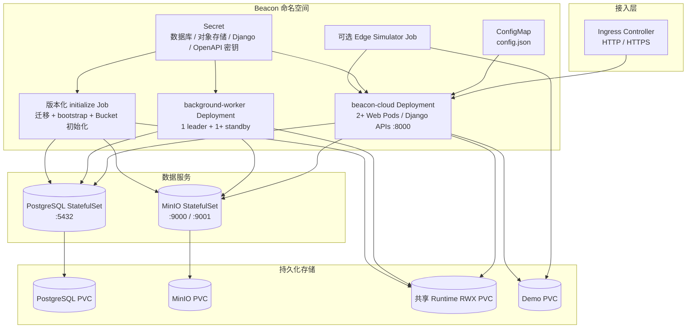

# Kubernetes 部署指南

本文档说明 Beacon Cloud SaaS v1 在 Kubernetes 集群中的 Helm 部署方式。当前 Chart 面向云端控制台场景，核心工作负载包括多副本 `beacon-cloud` Web、带 PostgreSQL advisory lock 选主的后台 Worker、版本化初始化 Job、PostgreSQL、MinIO，以及可选的边缘模拟 Job。

!!! note "部署边界"

    Kubernetes 部署使用容器镜像、Helm values、Kubernetes Secret / ConfigMap 和持久化卷，不接受 Windows EXE 或 DLL 作为 Pod 运行材料。

---

## 1. 前置条件

| 组件 | 最低版本 | 说明 |
|------|---------|------|
| Kubernetes | 1.24+ | 集群版本 |
| Helm | 3.10+ | Kubernetes 包管理器 |
| kubectl | 与集群版本匹配 | 集群管理工具 |
| 持久化存储 | -- | StorageClass，例如 local-path、NFS、Ceph 或云盘 |

### 可选组件

| 组件 | 用途 |
|------|------|
| Ingress Controller | Nginx Ingress / Traefik，提供外部 HTTP(S) 入口 |
| cert-manager | TLS 证书自动签发与续期 |
| Prometheus + Grafana | 集群和业务服务监控 |
| Loki / EFK | 容器日志聚合 |
| External Secrets Operator / Sealed Secrets | 生产环境密钥管理 |

---

## 2. Helm Chart 概览

Beacon Cloud SaaS v1 Helm Chart 位于 `deploy/cloud-saas-v1/chart/` 目录。

```text
deploy/cloud-saas-v1/chart/
├── Chart.yaml
├── values.yaml
└── templates/
    ├── _helpers.tpl
    ├── background-worker-deployment.yaml
    ├── beacon-cloud-deployment.yaml
    ├── configmap.yaml
    ├── edge-simulator-job.yaml
    ├── ingress.yaml
    ├── initialize-job.yaml
    ├── minio-statefulset.yaml
    ├── network-policy.yaml
    ├── pod-disruption-budget.yaml
    ├── postgres-statefulset.yaml
    ├── pvc.yaml
    ├── runtime-pvc.yaml
    ├── secret.yaml
    ├── serviceaccount.yaml
    ├── services.yaml
    └── tests/
        └── test-connection.yaml
```

### 部署架构


```mermaid
graph TD
    subgraph 接入层
        Ingress[Ingress Controller<br/>HTTP / HTTPS]
    end

    subgraph Beacon 命名空间
        Cloud[beacon-cloud Deployment<br/>2+ Web Pods / Django APIs :8000]
        Worker[background-worker Deployment<br/>1 leader + 1+ standby]
        Init[版本化 initialize Job<br/>迁移 + bootstrap + Bucket 初始化]
        Config[ConfigMap<br/>config.json]
        Secret[Secret<br/>数据库 / 对象存储 / Django / OpenAPI 密钥]
        EdgeJob[可选 Edge Simulator Job]
    end

    subgraph 数据服务
        Postgres[(PostgreSQL StatefulSet<br/>:5432)]
        MinIO[(MinIO StatefulSet<br/>:9000 / :9001)]
    end

    subgraph 持久化存储
        PGData[(PostgreSQL PVC)]
        MinIOData[(MinIO PVC)]
        RuntimeData[(共享 Runtime RWX PVC)]
        DemoPVC[(Demo PVC)]
    end

    Ingress --> Cloud
    Config --> Cloud
    Secret --> Cloud
    Secret --> Worker
    Secret --> Init
    Cloud --> Postgres
    Cloud --> MinIO
    Worker --> Postgres
    Worker --> MinIO
    Init --> Postgres
    Init --> MinIO
    EdgeJob --> Cloud
    Postgres --> PGData
    MinIO --> MinIOData
    Cloud --> RuntimeData
    Worker --> RuntimeData
    Init --> RuntimeData
    EdgeJob --> DemoPVC
    Cloud --> DemoPVC
```

当前 Chart 不包含独立的 MediaServer、Analyzer 或边缘侧运行时工作负载。边缘节点运行在各自站点，通过 Cloud 控制台创建的集群令牌接入本 Chart 部署的云端服务。

---

## 3. 快速部署

### 3.1 准备 values 文件

```bash title="复制并编辑 values 文件"
cp deploy/cloud-saas-v1/chart/values.yaml deploy/cloud-saas-v1/chart/my-values.yaml
vim deploy/cloud-saas-v1/chart/my-values.yaml
```

生产环境应先由 External Secrets、Vault、Sealed Secrets 或平台密钥系统创建
Secret，并且只把 Secret 名称交给 Helm：

```yaml title="my-values.yaml - 生产必填项"
beaconCloud:
  image:
    repository: registry.example.com/beacon-cloud-saas-v1
    tag: v1.0.1-rc.1
    digest: sha256:替换为镜像仓库返回的64位小写十六进制摘要
  secrets:
    existingSecret: beacon-production-secrets
```

生产模式会校验应用镜像摘要，缺失或不是 `sha256:<64 位小写十六进制>` 时
Helm 将拒绝渲染。Chart 内置的 PostgreSQL、MinIO、mc 和测试镜像也已固定摘要。

预创建的 Secret 必须包含以下键；具体值不得写入仓库、Helm values 或命令历史：

| 键 | 用途 |
|----|------|
| `postgres-password` | PostgreSQL 密码 |
| `beacon-cloud-db-url` | 完整 PostgreSQL DSN |
| `minio-root-user` | 对象存储访问账号 |
| `minio-root-password` | 对象存储访问密钥 |
| `beacon-open-api-token` | OpenAPI/Ops Bearer Token |
| `beacon-django-secret-key` | Django 签名密钥 |
| `beacon-edge-token-pepper` | Edge Token 哈希 pepper |
| `beacon-bootstrap-admin-username` | 初始管理员账号 |
| `beacon-bootstrap-admin-password` | 初始管理员密码 |

仅用于隔离演示环境时，也可以不设置 `existingSecret`，改为在受控的临时 values
文件中填写 `beaconCloud.secrets.*`、`postgres.auth.password` 和
`minio.rootPassword`；该模式会把值写入 Helm Release 历史，不得用于生产。

随机密钥可通过以下命令生成后直接写入密钥系统：

```bash title="生成随机密钥"
python3 -c "import secrets; print(secrets.token_urlsafe(48))"
```

### 3.2 安装 Chart

```bash title="使用 Helm 安装"
kubectl create namespace beacon

helm install beacon-cloud ./deploy/cloud-saas-v1/chart/ \
  -n beacon \
  -f deploy/cloud-saas-v1/chart/my-values.yaml

kubectl -n beacon get pods -w
```

### 3.3 验证部署

```bash title="验证 Kubernetes 资源"
kubectl -n beacon get all
kubectl -n beacon get pvc
kubectl -n beacon logs -f deployment/beacon-cloud
kubectl -n beacon logs -f statefulset/beacon-cloud-postgres
kubectl -n beacon logs -f statefulset/beacon-cloud-minio
```

本地测试可通过端口转发访问云端控制台：

```bash title="端口转发"
kubectl -n beacon port-forward svc/beacon-cloud 9991:8000
```

浏览器访问 `http://localhost:9991`。默认管理员账号来自所引用 Secret 的
`beacon-bootstrap-admin-username` 和 `beacon-bootstrap-admin-password`。

---

## 4. values.yaml 关键配置

### 4.1 Beacon Cloud 服务

```yaml title="values.yaml - beaconCloud"
beaconCloud:
  replicaCount: 2
  image:
    repository: beacon-cloud-saas-v1
    tag: v1.0.1-rc.1
    # 生产环境必填，必须来自已推送镜像的 registry digest。
    digest: ""
    pullPolicy: IfNotPresent
  service:
    type: ClusterIP
    port: 8000
  env:
    deploymentMode: cloud
    djangoDebug: "0"
    djangoAllowedHosts: "beacon-cloud.local,beacon-cloud,127.0.0.1"
    cloudImagePreviewProxy: "1"
    bootstrapEdgeClusterName: edge-default
    bootstrapEdgeTokenFile: ""
  resources:
    requests:
      cpu: 100m
      memory: 256Mi
      ephemeralStorage: 1Gi
    limits:
      cpu: 1000m
      memory: 1Gi
      ephemeralStorage: 2Gi
  runtimeStorage:
    persistence:
      enabled: true
      # 生产环境建议引用平台预创建、已验证跨节点挂载的 RWX PVC。
      existingClaim: beacon-runtime-rwx

backgroundWorker:
  replicaCount: 2
  standbyPollSeconds: 5
  heartbeat:
    intervalSeconds: 5
    maxAgeSeconds: 20
```

Web Pod 只运行请求路径所需的服务；计划、留存清理和 Outbox 等单例任务由
`background-worker` 承担。两个 Worker 使用独立 PostgreSQL 会话上的 advisory lock
选主，非 leader 保持 standby，leader 退出或数据库会话失效后自动竞争接管。

`initialize` Job 按 Helm Release revision 命名，只负责串行执行 migration、幂等
bootstrap 和 Bucket 初始化。Web/Worker 入口仅等待 schema 就绪，不会在每个 Pod
重复执行迁移或创建管理员。

### 4.2 Beacon config.json 映射

`templates/configmap.yaml` 将 `.Values.config` 直接渲染为容器内 `/app/config.json`。

```yaml title="values.yaml - config"
config:
  code: cloud-demo
  name: Beacon Cloud Demo
  describe: Beacon Cloud SaaS v1 Helm deployment
  siteName: Beacon
  siteTitle: Beacon Cloud SaaS v1
  host: 127.0.0.1
  adminPort: 9991
  mediaHttpPort: 9992
  analyzerPort: 9993
  mediaRtspPort: 9994
  mediaRtmpPort: 9995
  openApiToken: ""
  uploadDir: /app/data/upload
  modelDir: /app/data/models
  alarmOutboxEnabled: true
```

### 4.3 密钥配置

```yaml title="values.yaml - Secret 来源"
beaconCloud:
  secrets:
    openApiToken: ""
    djangoSecretKey: ""
    edgeTokenPepper: ""
    bootstrapAdminUsername: admin
    bootstrapAdminPassword: ""

postgres:
  auth:
    database: beacon
    username: beacon
    password: ""

minio:
  rootUser: beacon-minio
  rootPassword: ""
```

Chart 会将上述值写入 Kubernetes Secret，并以环境变量方式注入 `beacon-cloud` 容器。生产环境不得使用默认空值或示例弱密钥。

### 4.4 PostgreSQL

```yaml title="values.yaml - postgres"
postgres:
  enabled: true
  image:
    repository: postgres
    tag: 16-alpine
    pullPolicy: IfNotPresent
  auth:
    database: beacon
    username: beacon
    password: ""
  service:
    port: 5432
  persistence:
    enabled: true
    accessModes:
      - ReadWriteOnce
    size: 8Gi
    storageClassName: ""
```

### 4.5 MinIO

```yaml title="values.yaml - minio"
minio:
  enabled: true
  externalEndpointURL: ""
  image:
    repository: minio/minio
    tag: RELEASE.2025-09-07T16-13-09Z
    pullPolicy: IfNotPresent
  mcImage:
    repository: minio/mc
    tag: RELEASE.2025-08-13T08-35-41Z
    pullPolicy: IfNotPresent
  rootUser: beacon-minio
  rootPassword: ""
  bucket: beacon-cloud
  region: us-east-1
  service:
    apiPort: 9000
    consolePort: 9001
  persistence:
    enabled: true
    accessModes:
      - ReadWriteOnce
    size: 10Gi
    storageClassName: ""
```

### 4.6 Demo 卷与边缘模拟

```yaml title="values.yaml - demoVolume 和 edgeSimulator"
demoVolume:
  enabled: true
  accessModes:
    - ReadWriteOnce
  size: 1Gi
  storageClassName: ""

edgeSimulator:
  enabled: false
  image:
    repository: beacon-cloud-saas-v1
    tag: v1.0.1-rc.1
    pullPolicy: IfNotPresent
  cloudBaseURL: ""
  restartPolicy: OnFailure
  resources: {}
```

`demoVolume` 默认关闭；启用 `edgeSimulator` 时必须同时显式启用该卷，并为模拟器
镜像填写 digest。`edgeSimulator.enabled` 仅用于演示和验收，不替代生产边缘节点部署。

### 4.7 NetworkPolicy

Chart 默认创建三条仅限制入站的 `NetworkPolicy`：Beacon Web 接受同命名空间 Pod，
内置 PostgreSQL 和 MinIO 只接受本 Release 的 Beacon Pod。集群 CNI 必须支持
`NetworkPolicy` 才会实际执行这些规则。

Ingress Controller 或 Prometheus 位于其他命名空间时，在生产 values 中增加同时限定
命名空间和 Pod 的来源，例如：

```yaml title="values.yaml - 跨命名空间 Ingress 来源"
networkPolicy:
  enabled: true
  beaconIngressFrom:
    - namespaceSelector:
        matchLabels:
          kubernetes.io/metadata.name: ingress-nginx
      podSelector:
        matchLabels:
          app.kubernetes.io/name: ingress-nginx
```

不要为了图省事把来源改成所有命名空间。Chart 不默认限制出站，因为外部 PostgreSQL、
S3、告警 Webhook 和边缘地址因环境而异；若组织基线要求默认拒绝出站，应由平台层按
实际 DNS、数据库、对象存储和外发目标建立 allowlist，并留存连通性测试证据。

---

## 5. 持久化存储

当前 Chart 包含四类持久化资源。

| 资源 | 默认大小 | 访问模式 | 用途 |
|------|----------|----------|------|
| `beacon-cloud-postgres` volumeClaimTemplates | 8Gi | ReadWriteOnce | PostgreSQL 数据 |
| `beacon-cloud-minio` volumeClaimTemplates | 10Gi | ReadWriteOnce | MinIO 对象数据 |
| `beacon-cloud-runtime` PVC | 10Gi | ReadWriteMany | Web/Worker 共享的上传、模型和兼容运行时文件 |
| `beacon-cloud-demo` PVC（默认不创建） | 1Gi | ReadWriteOnce | 演示数据和边缘模拟共享卷 |

```yaml title="values.yaml - 存储类示例"
postgres:
  persistence:
    enabled: true
    storageClassName: fast-ssd
    size: 50Gi

minio:
  persistence:
    enabled: true
    storageClassName: object-storage
    size: 200Gi

beaconCloud:
  runtimeStorage:
    persistence:
      enabled: true
      existingClaim: beacon-runtime-rwx

demoVolume:
  enabled: true
  storageClassName: standard
  size: 10Gi
```

生产环境建议：

- PostgreSQL 使用低延迟块存储，并建立数据库备份策略。
- MinIO 按截图、录像、预览图片等对象容量规划存储大小。
- 多 Web 副本必须共享同一个 RWX runtime PVC；Chart 会拒绝“多副本 + `emptyDir`”以及
  生成 PVC 却缺少 `ReadWriteMany` 的配置。生产环境优先使用经过跨节点挂载、备份和
  配额验证的 `existingClaim`。
- `demoVolume` 仅承载演示或模拟数据，生产边缘上传链路应走对象存储和云端接口。
- 禁止将数据库和对象存储数据放在无持久化保障的临时卷中。

---

## 6. Ingress 配置

Ingress 配置位于 `beaconCloud.ingress`。

### 6.1 基础 HTTP Ingress

```yaml title="values.yaml - HTTP Ingress"
beaconCloud:
  ingress:
    enabled: true
    className: nginx
    annotations:
      nginx.ingress.kubernetes.io/proxy-body-size: "200m"
      nginx.ingress.kubernetes.io/proxy-read-timeout: "300"
      nginx.ingress.kubernetes.io/proxy-send-timeout: "300"
    hosts:
      - host: beacon.example.com
        paths:
          - path: /
            pathType: Prefix
    tls: []
```

### 6.2 HTTPS Ingress

```yaml title="values.yaml - HTTPS Ingress"
beaconCloud:
  ingress:
    enabled: true
    className: nginx
    annotations:
      cert-manager.io/cluster-issuer: letsencrypt-prod
      nginx.ingress.kubernetes.io/ssl-redirect: "true"
      nginx.ingress.kubernetes.io/proxy-body-size: "200m"
      nginx.ingress.kubernetes.io/proxy-read-timeout: "300"
    hosts:
      - host: beacon.example.com
        paths:
          - path: /
            pathType: Prefix
    tls:
      - secretName: beacon-cloud-tls
        hosts:
          - beacon.example.com
```

Chart 会将所有 Ingress path 路由到 `beacon-cloud` Service，Service 端口来自 `beaconCloud.service.port`。

---

## 7. 实例边界与调度

### 7.1 Beacon Cloud 副本数

```yaml title="values.yaml - 副本数"
beaconCloud:
  replicaCount: 2
backgroundWorker:
  replicaCount: 2
```

当前 Chart 的应用层基线是两个 Web Pod 和两个后台 Worker Pod。Web 使用
`RollingUpdate(maxUnavailable=0)`；后台 Worker 通过 PostgreSQL advisory lock 保证
同一时刻只有一个 leader 执行单例任务，另一个作为热 standby。生产模式（引用
`existingSecret`）少于两个 Web 或两个 Worker 时，Helm 会拒绝渲染。

这只是 Cloud 应用层冗余，不等于整套系统 HA。Chart 内置 PostgreSQL 和 MinIO 仍是
单实例，MediaServer/Analyzer 也不在本 Chart 内；完整 HA 仍需托管数据库/对象存储、
跨节点 RWX 存储、Ingress 多副本以及实际故障演练。详细边界见[集群部署](cluster.md)。

### 7.2 节点调度

```yaml title="values.yaml - 调度约束"
beaconCloud:
  nodeSelector:
    workload: beacon-cloud
  tolerations:
    - key: workload
      operator: Equal
      value: beacon-cloud
      effect: NoSchedule
  affinity: {}
```

PostgreSQL 和 MinIO 在当前 Chart 中未暴露独立的 `nodeSelector` / `affinity` 字段；需要固定调度策略时，应在 Chart 模板中补充对应 values 字段并纳入 Helm 渲染测试。

### 7.3 自动伸缩

当前 Chart 未提供 HPA。Web 已与单例调度任务解耦，可在共享 runtime PVC、数据库连接
预算和会话/限流状态满足目标环境要求后人工增加副本；后台 Worker 的副本数主要提供
standby，不会线性增加任务吞吐。启用 HPA 前必须补齐目标集群的扩缩容、连接池和压测证据。

---

## 8. ConfigMap 和 Secret 渲染

### 8.1 ConfigMap

```yaml title="templates/configmap.yaml"
apiVersion: v1
kind: ConfigMap
metadata:
  name: {{ include "beacon-cloud-saas-v1.fullname" . }}-config
  labels:
    {{- include "beacon-cloud-saas-v1.labels" . | nindent 4 }}
data:
  config.json: |
    {{- toJson .Values.config | nindent 4 }}
```

`beacon-cloud` Deployment 将该 ConfigMap 挂载到 `/app/config.json`。

### 8.2 Secret

`beaconCloud.secrets.existingSecret` 为空时，Chart 会为演示环境渲染一个 Secret，
并强制所有必需值非空。设置该字段后，Chart 不再创建 Secret，所有工作负载统一
引用指定名称；这样密钥不会进入 Helm values 和 Release manifest。外部 Secret
轮换后需要执行受控的 Deployment 滚动重启，让环境变量重新注入。

Beacon Pod 还采用以下强制基线：

- `runAsNonRoot`，UID/GID `10001`；
- `RuntimeDefault` seccomp、禁止提权、丢弃全部 Linux capabilities；
- 根文件系统只读；不可变静态资源已在镜像构建期生成，`/app/data` 使用共享 runtime PVC，`/tmp` 使用有大小限制的 `emptyDir`；
- startup/liveness 探针验证 `/healthz`，readiness 探针验证 `/readyz`，并使用 Secret 注入的 Token 完成鉴权；
- Web `/readyz` 检查数据库、对象存储 Bucket、Cloud 必需配置与 Web 角色服务；Worker 使用带时效校验的本地 heartbeat 探针，leader 还必须报告后台服务 `running`。对象存储探测使用 1 秒连接/读取超时且不重试。

Chart 内置的 PostgreSQL 与 MinIO 同样以非 root、只读根文件系统、
`RuntimeDefault` seccomp 和 drop-all capabilities 运行，并提供 startup、readiness、
liveness 探针。启用内置 MinIO 时，版本化 `initialize` Job 中的非 root、只读根
init container 会有限重试并幂等创建 Bucket；随后初始化容器持有独立数据库锁执行
migration 和 bootstrap。首次空库时 Web/Worker 会等待 schema；发布流水线仍必须使用
`--wait --wait-for-jobs` 并确认 initialize Job 为 `Complete`，不能只看 Web readiness。

设置 `postgres.enabled=false` 或 `minio.enabled=false` 可使用托管服务，但生产模式
必须同时使用 `existingSecret`。数据库目标从 `beacon-cloud-db-url` 解析；外置 S3
兼容服务通过 `minio.externalEndpointURL` 配置，AWS S3 可留空。外部 Bucket 必须由
基础设施流程预先创建。

`/app/data` 包含可变上传和兼容文件，必须使用共享持久卷；主要业务记录与大对象仍应
分别进入 PostgreSQL 和对象存储，并纳入统一备份、配额与留存策略。

---

## 9. 监控与告警

当前 Chart 未内置 ServiceMonitor 或 PrometheusRule。`/metrics` 受 OpenAPI Token 保护；Prometheus Operator 环境可引用 Chart 生成的 Secret。下面的 Secret 名称以 Release `beacon-cloud` 为例，实际名称请用 `kubectl get secret -n beacon` 确认。

```yaml title="ServiceMonitor 示例"
apiVersion: monitoring.coreos.com/v1
kind: ServiceMonitor
metadata:
  name: beacon-cloud
  namespace: beacon
  labels:
    release: prometheus
spec:
  selector:
    matchLabels:
      app.kubernetes.io/instance: beacon-cloud
  endpoints:
    - port: http
      path: /metrics
      interval: 30s
      scrapeTimeout: 10s
      authorization:
        type: Bearer
        credentials:
          name: beacon-cloud-secret
          key: beacon-open-api-token
  namespaceSelector:
    matchNames:
      - beacon
```

推荐监控项：

| 指标类型 | 具体指标 | 告警阈值建议 |
|---------|---------|-------------|
| Pod 状态 | Running / Pending / Failed | Failed > 0 |
| CPU 使用率 | 容器 CPU 使用百分比 | > 80% 持续 5 分钟 |
| 内存使用率 | 容器内存使用百分比 | > 85% 持续 5 分钟 |
| PVC 使用率 | PostgreSQL、MinIO 数据卷已用空间 | > 80% |
| HTTP 错误率 | Ingress 或应用 5xx 比例 | > 5% 持续 2 分钟 |
| 响应时间 | P95 响应延迟 | > 2 秒 |
| Pod 重启次数 | kube_pod_container_status_restarts_total | > 3 次/小时 |

---

## 10. 常用运维命令

```bash title="Helm 管理"
# 安装
helm install beacon-cloud ./deploy/cloud-saas-v1/chart/ \
  -n beacon \
  -f deploy/cloud-saas-v1/chart/my-values.yaml

# 升级
helm upgrade beacon-cloud ./deploy/cloud-saas-v1/chart/ \
  -n beacon \
  -f deploy/cloud-saas-v1/chart/my-values.yaml

# 指定应用镜像版本
helm upgrade beacon-cloud ./deploy/cloud-saas-v1/chart/ \
  -n beacon \
  -f deploy/cloud-saas-v1/chart/my-values.yaml \
  --set beaconCloud.image.tag=v1.0.1-rc.1

# 查看 Release
helm list -n beacon
helm get values beacon-cloud -n beacon
helm get manifest beacon-cloud -n beacon

# 回滚和卸载
helm rollback beacon-cloud 1 -n beacon
helm uninstall beacon-cloud -n beacon
```

```bash title="kubectl 管理"
# 查看资源
kubectl -n beacon get pods -o wide
kubectl -n beacon get deploy,statefulset,job,svc,pvc,ingress

# 查看日志
kubectl -n beacon logs -f deployment/beacon-cloud
kubectl -n beacon logs -f statefulset/beacon-cloud-postgres
kubectl -n beacon logs -f statefulset/beacon-cloud-minio

# 进入容器
kubectl -n beacon exec -it deployment/beacon-cloud -- bash

# 查看事件和配置
kubectl -n beacon describe pod <pod-name>
kubectl -n beacon get configmap beacon-cloud-config -o yaml
kubectl -n beacon get secret beacon-cloud-secret

# 端口转发
kubectl -n beacon port-forward svc/beacon-cloud 9991:8000
```

---

## 11. 更新与回滚

Web 与 Worker 使用滚动更新和 PDB，正常计划内更新不应中断全部 Web 副本。数据库迁移
仍必须采用 expand/contract 兼容策略；Helm 回滚不会自动回滚 schema。更新前先完成数据库、
对象存储和 runtime PVC 备份，并设置明确维护窗口与失败处置。

### 11.1 执行更新

```bash title="执行更新"
helm upgrade beacon-cloud ./deploy/cloud-saas-v1/chart/ \
  -n beacon \
  -f deploy/cloud-saas-v1/chart/my-values.yaml \
  --wait --wait-for-jobs --atomic --timeout 15m

kubectl -n beacon wait --for=condition=complete job/beacon-cloud-init-<revision> --timeout=15m
kubectl -n beacon rollout status deployment/beacon-cloud
kubectl -n beacon rollout status deployment/beacon-cloud-background-worker
kubectl -n beacon rollout history deployment/beacon-cloud
```

### 11.2 回滚

```bash title="回滚操作"
helm rollback beacon-cloud 1 -n beacon

kubectl -n beacon rollout undo deployment/beacon-cloud
kubectl -n beacon rollout undo deployment/beacon-cloud --to-revision=2
```

---

## 12. 生产部署检查清单

??? abstract "基础设施检查"

    - [ ] Kubernetes 集群版本 >= 1.24
    - [ ] Helm >= 3.10 已安装
    - [ ] StorageClass 已配置并可用
    - [ ] 命名空间已创建
    - [ ] Ingress Controller 已部署
    - [ ] 镜像仓库和镜像拉取凭据已配置

??? abstract "安全检查"

    - [ ] `beaconCloud.secrets.existingSecret` 指向外部密钥系统管理的 Secret
    - [ ] `beaconCloud.image.digest` 是仓库返回的实际 sha256 摘要
    - [ ] 外部 Secret 包含文档列出的全部键，且每个敏感值唯一、强随机
    - [ ] 生产 Helm values 和 Release manifest 中不存在明文密钥
    - [ ] Secret 轮换后已执行并验证 Deployment 滚动重启
    - [ ] Ingress 已配置 TLS/HTTPS
    - [ ] 未设置 `BEACON_CLOUD_ALLOW_INSECURE_HTTP`，Session/CSRF Cookie 均为 Secure
    - [ ] CNI 支持 NetworkPolicy，跨命名空间 Ingress/监控来源 selector 已按最小范围配置并实测
    - [ ] 生产 values 文件未提交到公开 Git 仓库
    - [ ] Pod 为非 root、只读根、`RuntimeDefault` seccomp 且 capabilities 已全部丢弃

??? abstract "可靠性检查"

    - [ ] Web 与 Worker 副本均不少于 `2`，PDB 和跨节点调度策略已实测
    - [ ] `/app/data` 使用可跨节点挂载的 RWX `existingClaim`，上传后从任一 Web 副本均可读取
    - [ ] 所有容器已设置 requests 和 limits
    - [ ] PostgreSQL、MinIO 与 runtime PVC 已绑定成功
    - [ ] initialize Job `Complete`，Web/Worker startup/readiness/liveness 探针均通过
    - [ ] 已停止当前 Worker leader 并确认 standby 自动接管且 Outbox/计划未重复执行
    - [ ] 数据库、对象存储和 runtime PVC 的备份恢复策略已演练
    - [ ] 已接受内置 PostgreSQL/MinIO、Analyzer 与 MediaServer 不具备自动故障转移的边界

??? abstract "可观测性检查"

    - [ ] 应用日志已接入集中日志系统
    - [ ] Pod、PVC、Ingress 指标已接入监控系统
    - [ ] 核心告警规则已配置
    - [ ] 发布、回滚和故障处理命令已纳入运维手册
