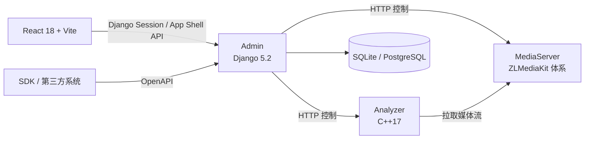

# 开发者指南

Beacon 是一个包含 Django/React 管理端、C++ Analyzer、ZLMediaKit 分支和三种 SDK 的多语言仓库。先确定要修改的组件，再使用该组件自己的依赖和测试命令。

## 技术边界



- Admin 使用 Django 原生视图和 URL 路由，不依赖 Django REST Framework。
- React 前端源码位于 `Admin/frontend/`，构建产物写入 `Admin/static/app-shell/`。
- Admin 的 App Shell 接口是内部 UI 契约；第三方集成优先使用 `/open/*` 及仓库内 SDK。
- Analyzer 的 CUDA、TensorRT、OpenVINO 和 NPU 可用性取决于部署者提供的合法运行时、模型及插件。

## 最小开发环境

| 组件 | 基线 |
|---|---|
| Admin | Python 3.10–3.12，`Admin/requirements-linux.txt` 或 Windows 对应文件 |
| Frontend | Node.js `^20.19.0` 或 `>=22.12.0` |
| Analyzer | CMake 3.16+、C++17 编译器及文档列出的原生依赖 |
| MediaServer | CMake、C/C++ 工具链及 ZLMediaKit 所需依赖 |
| Docs | `docs/requirements.txt` |

## 从 Admin 开始

```bash
cd Admin
python3 -m venv venv
source venv/bin/activate
python -m pip install -r requirements-linux.txt
python manage.py migrate --noinput
python manage.py createsuperuser
python manage.py runserver 0.0.0.0:9991
```

开发 React 页面：

```bash
cd Admin/frontend
npm ci
npm test
npm run build
```

Analyzer 和 MediaServer 需要系统原生库，不建议只凭一条通用 CMake 命令猜测环境。Linux 先看 [本机开发](../deployment/local-linux.md)，Windows 先看 [本机开发](../deployment/local-windows.md)。

## 提交前检查

```bash
python tools/docs_strict_check.py
mkdocs build --strict

cd Admin
BEACON_DISABLE_BACKGROUND=1 python manage.py test app.tests
BEACON_DISABLE_BACKGROUND=1 python manage.py makemigrations --check --dry-run
```

前端、Analyzer、MediaServer 和 SDK 的测试命令见 [贡献指南](contributing.md)。不要提交模型权重、数据库、上传文件、日志、虚拟环境或构建目录。

## 继续阅读

- [项目结构](structure.md)
- [贡献指南](contributing.md)
- [系统架构](../architecture/index.md)
- [API 边界](../api/index.md)
