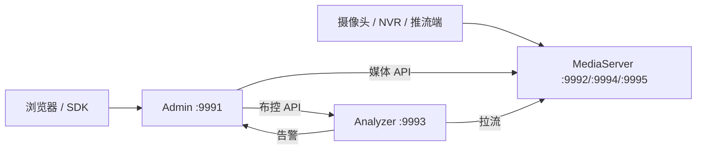

# 快速入门

Beacon 源码包含三个进程，但仓库不包含模型权重、厂商推理 SDK 或预编译的完整交付环境。因此“能打开 Admin 页面”和“真实摄像头检测已跑通”是两种不同的验收目标。

## 选择目标

| 目标 | 启动内容 | 入口 |
|---|---|---|
| 查看 Cloud 页面与告警聚合 | Admin + PostgreSQL + MinIO + Edge 模拟器 | [5 分钟 Cloud POC](quickstart.md) |
| 开发 Django/React 管理端 | Admin，必要时前端开发服务器 | [安装指南](installation.md) |
| 接入真实摄像头并检测 | Admin + MediaServer + Analyzer + 合法模型/运行时 | [第一条视频流](first-stream.md) |
| 准备私有化交付 | 编译产物、模型、授权、依赖和服务托管配置 | [Edge 全栈](../deploy/edge-full-stack.md) |

## 当前架构

| 组件 | 默认端口 | 职责 |
|---|---:|---|
| Admin | 9991 | Django/React、配置、布控、告警、Cloud 与 OpenAPI |
| MediaServer | 9992 / 9994 / 9995 | HTTP、RTSP、RTMP 媒体控制与分发 |
| Analyzer | 9993 | 解码、推理、追踪和告警生成 |

端口可由 `config.json` 改写；摄像头常见的 RTSP `554` 是设备侧地址，不等于 Beacon MediaServer 默认监听 `554`。

## 推荐顺序

1. 阅读 [环境与依赖](requirements.md)，确认目标平台、原生库和端口。
2. 使用 [5 分钟 Cloud POC](quickstart.md) 验证 Admin、数据库和 Cloud 告警页面。
3. 按 [安装指南](installation.md) 准备 Edge 三进程。
4. 用 [第一条视频流](first-stream.md) 跑通真实链路。
5. 按 [端到端验收](../deploy/e2e-acceptance.md) 留存版本、模型哈希、日志和结果。

容量不能按视频路数直接承诺。使用目标模型、分辨率、抽帧、Provider 和录像设置做基线压测，参见 [性能调优](../operations/performance.md)。
