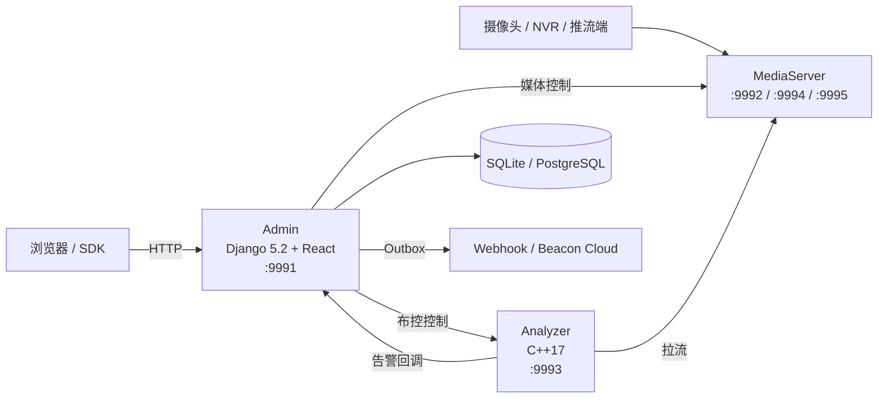

---
hide:
  - navigation
  - toc
---

# Beacon

### 面向边缘与私有化场景的智能视频分析平台

Beacon 将视频流管理、C++ 推理、布控告警和运维控制台组合在一个仓库中。源码由 Admin、Analyzer 和 MediaServer 三个进程组成；模型权重、厂商 SDK 和需要单独授权的硬件运行时不随仓库分发。

## 先选入口

### :material-laptop: Admin 开发

开发 Django/React 页面、权限、Cloud 控制台或 OpenAPI。

[:octicons-arrow-right-24: Linux 本机开发](deployment/local-linux.md)

### :material-video: Edge 全栈

接入真实摄像头、MediaServer、Analyzer、模型与硬件运行时。

[:octicons-arrow-right-24: Edge 部署](deploy/edge-full-stack.md)

### :material-cloud-outline: Cloud POC

验证 Cloud 登录、边缘注册与告警聚合；默认不含推理和媒体进程。

[:octicons-arrow-right-24: Cloud SaaS v1](integration/cloud-saas-v1.md)

### :material-package-variant-closed: 交付与运维

准备二进制、模型、授权和依赖齐全的私有化交付包。

[:octicons-arrow-right-24: 交付包规范](deploy/delivery-layout.md)

## 当前能力边界

| 能力 | 当前实现 |
|---|---|
| 视频 | MediaServer 负责拉流代理、播放、录像和协议分发；具体来源与输出协议需按设备和配置验证 |
| 分析 | Analyzer 提供 ONNX Runtime、OpenVINO 及插件路径；模型和厂商运行时由部署者提供 |
| 布控 | Admin 绑定视频、算法、ROI、阈值和计划，并控制 Analyzer 任务 |
| 告警 | 告警入库、媒体证据、审核，以及 Webhook / Beacon Cloud 至少一次投递 |
| Cloud | Edge 注册、远程资源视图和告警聚合；参考部署为单实例 POC |
| 集成 | 既有 Machine OpenAPI、Ops、Cloud 和数字人运行时协议；不是统一 REST v1 |
| SDK | Python、JavaScript、Go 客户端封装当前对外路径 |

算法定义、GPU/NPU 后缀或页面入口只表示平台具备编排/接入路径，不保证对应模型、驱动或插件已安装。上线前必须用真实视频和目标模型完成链路与容量测试。

## 组件关系

完整说明见 [系统架构](architecture/index.md)。

## 文档入口

### :material-rocket-launch: 快速开始

了解仓库能直接启动的内容以及完整 Edge 还需要哪些外部依赖。

[:octicons-arrow-right-24: 开始](getting-started/index.md)

### :material-api: API 边界

真实路径、认证方式、兼容响应和 App Shell 内部接口边界。

[:octicons-arrow-right-24: API 概览](api/index.md)

### :material-puzzle: 算法接入

模型格式、前后处理、外部 API 算法和 C ABI 插件。

[:octicons-arrow-right-24: 算法文档](algorithms/index.md)

### :material-heart-pulse: 运维

安全、监控、性能基线、备份和故障排查。

[:octicons-arrow-right-24: 运维手册](operations/index.md)

## 许可证说明

Beacon 自研代码使用 MIT 许可证。`MediaServer/source/` 及其他第三方代码保留各自的上游许可证和附加条款；复制或发布前阅读根目录 `THIRD_PARTY_NOTICES.md` 和对应源码中的许可证。
