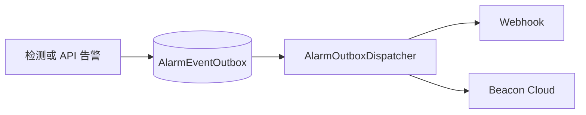

# 告警事件总线

Beacon 只保留两个告警出口：Webhook 与 Cloud。告警先写入 DB Outbox，再由分发器异步投递；关闭 Outbox 时走进程内异步发送。



## 启用条件

- Webhook：`alarmWebhookEnabled=true`，且 `alarmWebhookUrls` 至少有一个有效 URL。
- Cloud：`BEACON_CLOUD_ENABLED=1`，并配置 `BEACON_CLOUD_BASE_URL`、`BEACON_CLOUD_EDGE_TOKEN`。
- Outbox：`alarmOutboxEnabled=true`。

每个启用的出口对应一条 Outbox 记录。投递成功后标记为 `sent`；网络错误、HTTP 429 或 5xx 会重试；其他 4xx 视为永久失败。

## Webhook 配置

```json
{
  "alarmOutboxEnabled": true,
  "alarmWebhookEnabled": true,
  "alarmWebhookUrls": ["https://example.com/alarm"],
  "alarmWebhookSecret": "change-me",
  "alarmWebhookTimeoutSeconds": 5
}
```

也可使用环境变量：

- `BEACON_ALARM_WEBHOOK_URLS`
- `BEACON_ALARM_WEBHOOK_SECRET`
- `BEACON_ALARM_WEBHOOK_TIMEOUT_SECONDS`

## Cloud 配置

```bash
BEACON_CLOUD_ENABLED=1
BEACON_CLOUD_BASE_URL=https://cloud.example.com
BEACON_CLOUD_EDGE_TOKEN=replace-me
```

Cloud 出口会按需申请图片预签名地址、上传截图，再提交告警事件。没有截图时直接提交事件。

事件字段与 Webhook 验签规则见 [告警事件规范](alarm-event-bus.md)。
