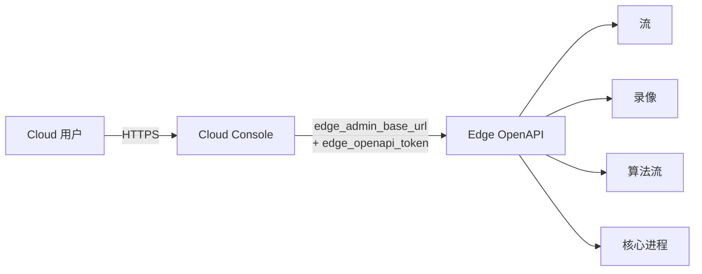

# 云远程控制面 (Cloud Remote Control Plane)

仓库内已经实现了一个 **基于现有 Edge OpenAPI 的云端远程控制面**,允许 Cloud 控制台直接通过边缘节点的 OpenAPI 完成视频流、录像、算法流和核心进程的远程查看与基本操作。

本页面回答四个问题:它能做什么?它依赖什么?如何接入?边界在哪里?

---

## 它能做什么

Cloud 控制台基于以下边缘 OpenAPI 提供 **最小远程能力集**:

- **远程视频流** —— 流列表、流详情、流编辑
- **远程录像** —— 录像列表、播放 URL 获取
- **远程算法流** —— 算法流概览
- **远程核心进程** —— 边缘平台核心进程概览

这些能力补齐了此前 Cloud SaaS 仅能在 `cluster/alarm` 层级聚合的不足,把 **远程查看与远程编辑** 的能力一次性上行到云端。



---

## 依赖的数据模型

云端通过 `CloudEdgeCluster` 模型记录每个边缘集群的远程接入参数。核心字段如下(完整字段见 `Admin/app/models.py` 中的 `CloudEdgeCluster`):

| 字段 | 类型 | 说明 |
|------|------|------|
| `project` | FK | 所属云项目(`CloudProject`) |
| `name` | CharField | 集群名称 |
| `edge_admin_base_url` | URL | 边缘 Admin 的对外可达地址,如 `https://edge-1.example.com` |
| `edge_openapi_token` | Text | 边缘 OpenAPI 调用凭据 |
| `edge_token_hash` | Char | 边缘 token 散列(用于反向校验上报身份) |
| `node_code` | Char | 节点编码 |
| `rollout_channel` / `rollout_status` / `rollout_target_version` | Char | 灰度/版本管理元数据 |
| `enabled` | Bool | 是否启用该集群 |
| `last_seen_at` | DateTime | 最后上报时间 |

云端在调用边缘 OpenAPI 时,统一使用 `edge_admin_base_url` 作为基址、`edge_openapi_token` 作为认证。

---

## 接入步骤

1. **在边缘侧准备 OpenAPI Token**
    - 在边缘 Admin 中生成一个具备只读或受限编辑权限的 API Key,详见 [认证鉴权](../api/authentication.md)
2. **在云端注册集群**
    - 通过云控制台「集群管理」录入 `name` / `edge_admin_base_url` / `edge_openapi_token`
    - 也可使用 Admin 后台直接创建 `CloudEdgeCluster` 记录
3. **租户与权限**
    - 远程能力仍受云端的租户、RBAC、资源域规则约束;具体策略复用现有的 Cloud SaaS 设计,见 [Cloud SaaS v1](cloud-saas-v1.md)
4. **验证连通性**
    - 在 Cloud 控制台进入对应集群的「远程视频流」页面,如果能看到流列表即接入成功
    - 也可通过 `curl` 直接调用 Edge OpenAPI 校验 token

```bash
curl -H "X-Beacon-Token: ${EDGE_OPENAPI_TOKEN}" \
  "${EDGE_ADMIN_BASE_URL}/open/getAllStreamData"
```

---

## 鉴权与权限模型

- 边缘侧: 使用 OpenAPI Token,token 应配置最小权限,推荐为远程读 + 受控编辑
- 云端侧: 复用现有
    - **租户隔离**(`CloudTenant` / `CloudProject`)
    - **RBAC**(角色/权限矩阵)
    - **资源域**(只能看见自己项目下的集群与对象)
- 请求链路: `Cloud User → Cloud Console (RBAC 校验) → Edge OpenAPI (Token 校验) → 边缘资源`

---

## 能力边界(明确不承诺的范围)

为了避免过度承诺,本能力 **不包含** 以下内容,需要专门的方案:

| 不在范围 | 说明 |
|----------|------|
| 公网通用兼容 | 边缘侧需要自行解决 NAT、反代、证书等可达性问题 |
| `nvs` 等私有协议 | 客户专有协议适配不在通用控制面内,按项目定制 |
| 自动反向隧道 | 当前实现要求云能直连边缘 `edge_admin_base_url`,不内置反向隧道 |
| Cloud→Edge 持续同步 | 不是双向数据同步,只是按需调用边缘 OpenAPI |

如果需要打穿无公网出口的边缘节点,请结合 VPN / 反向代理 / 隧道软件单独方案化处理。

---

## 与告警事件总线的关系

- `cluster/alarm` 路径下的告警上行: 由 [告警事件总线](alarm-event-bus.md) 负责
- 视频流 / 录像 / 算法流 / 核心进程的远程查看: 由本远程控制面负责

两者一起,构成 Cloud 控制台对边缘的 **观察 + 控制** 完整能力。

---

## 验收与健康检查

- 边缘侧: 通过 [API 文档](../api/index.md) 中的 OpenAPI 接口验证
- 云端侧: 注册边缘实例的 `edge_admin_base_url` 和凭据，再通过云端页面依次验证设备列表、流详情和受控操作
- 故障路径: 断开边缘网络或使用无效凭据，确认云端给出明确错误且不伪造成功数据
