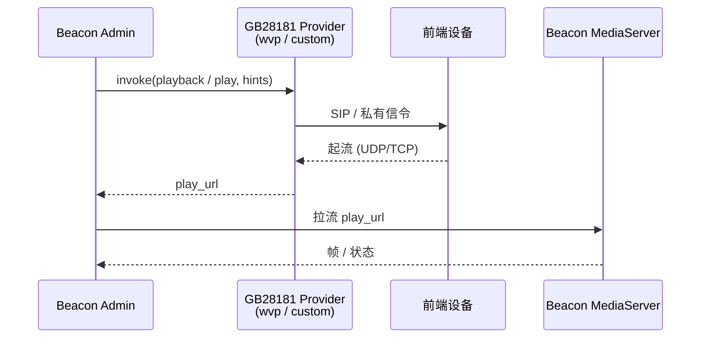

# GB28181 Provider TCP 模式集成

Beacon 自身 **不实现原生 GB28181 SIP 协议栈**。GB28181 设备的接入采用 **外部提供商 + 拉流回灌** 的模型:

1. Beacon 调用外部 provider(如 WVP-PRO 或自定义平台)请求开启回放或实时流
2. provider 返回一个可拉流的 `play_url`(通常是 RTSP / RTMP)
3. Beacon 把该流接入本地 MediaServer / Analyzer

本页面描述的是为这种模型新增的 **TCP 模式控制面**,让运维人员可以持久化并复用如下提示参数:

- `gb28181TransportMode`
- `gb28181StartupPolicy`
- `gb28181RequestParamPolicy`
- `gb28181RequestParamAllowlist`
- `gb28181RequestParamBlocklist`

---

## 整体接入示意



---

## 模板变量

外部 provider 模板可消费以下占位符,Beacon 在拼接 URL 前会进行 URL-encode:

| 占位符 | 来源字段 | 用途 |
|--------|----------|------|
| `{transportMode}` | `gb28181TransportMode` | 期望的传输模式提示,如 `udp` / `tcp-active` / `tcp-passive` |
| `{startupPolicy}` | `gb28181StartupPolicy` | 起流策略提示,如 `auto` / `lazy` |
| `{requestParamPolicy}` | `gb28181RequestParamPolicy` | 请求参数策略,如 `allowlist` / `blocklist` / `passthrough` |
| `{requestParamAllowlist}` | `gb28181RequestParamAllowlist` | 允许透传的查询键 |
| `{requestParamBlocklist}` | `gb28181RequestParamBlocklist` | 禁止透传的查询键 |

这些值都是 **请求提示** —— 是否生效取决于外部平台的实际实现。

---

## 配置位置

### 1. 系统配置(`config.json`)

参考 [config.json 参考](../configuration/config-json.md):

```json
{
  "gb28181Provider": "wvp",
  "gb28181WvpBaseUrl": "https://wvp.example.com",
  "gb28181TransportMode": "tcp-active",
  "gb28181StartupPolicy": "auto",
  "gb28181RequestParamPolicy": "allowlist",
  "gb28181RequestParamAllowlist": "stream,startTime,endTime",
  "gb28181RequestParamBlocklist": ""
}
```

### 2. 环境变量

参考 [环境变量](../configuration/env-vars.md#gb28181-env):

```bash
export BEACON_GB28181_TRANSPORT_MODE=tcp-active
export BEACON_GB28181_PROVIDER=wvp
export BEACON_GB28181_WVP_BASE_URL=https://wvp.example.com
```

### 3. Admin 后台

也可以在 Admin 的「系统配置 → GB28181」里通过 UI 设定,无需重启即可生效。

---

## WVP-PRO 模板示例

```text
${gb28181WvpBaseUrl}/api/play/start/{deviceId}/{channelId}?transportMode={transportMode}&policy={startupPolicy}
```

替换效果(transportMode=`tcp-active`、startupPolicy=`auto`):

```text
https://wvp.example.com/api/play/start/34020.../34021...?transportMode=tcp-active&policy=auto
```

---

## 自定义 provider 模板示例

```text
${customBaseUrl}/v1/playback?device={deviceId}&channel={channelId}&tm={transportMode}&allow={requestParamAllowlist}
```

!!! tip "占位符是可选的"
    `wvp` 与 `custom` 模式的既有用法保持兼容,只有当外部平台真的理解这些 hint 时,才需要把占位符填到模板里。

---

## 集成边界

下列内容 **不在** 本地控制面范围内,需要提供商或运维侧自行处理:

- NAT 穿透与端口暴露
- SIP 注册加密与证书校验
- 提供商自身的启动顺序(信令再起流)
- 私有 SDK 的实现细节

本控制面 **只负责** 把上述提示参数 **统一管理、规范模板替换**,让运维不再被分散在配置表中的零散开关绊住。

---

## 验收路径

- 启动配置检查: `python Admin/manage.py check`（只验证 Django 配置可加载，不替代 provider 实测）
- 配置一个真实的外部 provider，确认 TCP 提示参数按模板替换后送达
- 在 Beacon 中开流，同时检查 provider 日志、MediaServer 流列表和网页播放
- 分别验证正常路径、provider 超时和不支持提示参数时的错误信息

完成本地验收后,再去断言 **"外部平台支持同一组 hint"** —— 这是关键的接入纪律。
