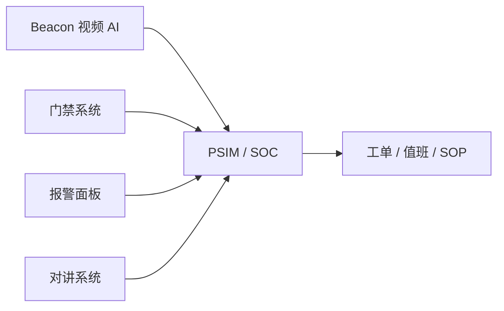

# PSIM / 安防 SOC 事件对接契约

本文定义 Beacon 对接 PSIM / SOC / 工单系统时的事件契约与集成边界。

Beacon 不需要在短期内自研门禁、报警主机或完整 PSIM。更稳妥的落地方式是把 Beacon 告警、审核、设备状态和后续 Case 事件按统一契约输出,让第三方 PSIM/SOC 把视频 AI 结果纳入已有安防流程。

---

## 对接目标

| 目标 | 说明 |
|------|------|
| 统一事件 | 把 Beacon 的 `alarm.created` 转成 PSIM 可消费的标准事件 |
| 保持幂等 | 使用 `event_id` 做去重,遵循至少一次投递 |
| 保留证据 | 事件必须带截图、录像、流、时间、算法、区域等证据线索 |
| 可回链 | 下游可以通过 URL 或 OpenAPI 回到 Beacon 查看详情 |
| 可扩展 | 后续接入门禁、对讲、报警面板时沿用同一字段模型 |

---

## 推荐集成方式

| 下游类型 | 推荐通道 | 说明 |
|----------|----------|------|
| 自研 SOC / 工单系统 | Webhook | JSON 结构清晰,便于验签和幂等 |
| PSIM 中间件 | Webhook + Outbox | 推荐作为标准对接方式 |

详细事件总线语义见 [告警事件总线事件规范](alarm-event-bus.md)。

---

## 标准事件模型

Beacon 原始事件使用 `schema = beacon.event.v1`。对接 PSIM 时建议映射为以下标准字段:

| 标准字段 | Beacon 来源 | 必填 | 说明 |
|----------|-------------|------|------|
| `event_id` | 顶层 `event_id` | 是 | 幂等去重主键 |
| `event_type` | 顶层 `event_type` | 是 | 例如 `alarm.created` |
| `occurred_at` | 顶层 `timestamp` | 是 | 事件发生时间 |
| `source_system` | 固定 `beacon` | 是 | 来源系统 |
| `node_code` | 顶层 `node_code` | 否 | 边缘节点 |
| `camera_id` | `data.stream_id` / `control_code` | 是 | 摄像头或布控标识 |
| `camera_name` | `data.stream_name` | 否 | 摄像头名称 |
| `site_id` | 项目侧补充 | 否 | 园区/站点 |
| `event_category` | 算法类型映射 | 是 | 入侵、火烟、PPE、跌倒等 |
| `severity` | 规则映射或 AI 分级 | 是 | `info/low/medium/high/critical` |
| `confidence` | `data.confidence` | 否 | 算法置信度 |
| `image_url` | `image_url` | 否 | 截图证据 |
| `video_url` | `video_url` | 否 | 录像证据 |
| `detail_url` | 集成方拼接 | 否 | 回到 Beacon 告警详情 |
| `raw_event` | 原始 JSON | 是 | 保留完整原文,便于追溯 |

---

## 事件示例

```json
{
  "event_id": "550e8400-e29b-41d4-a716-446655440000",
  "event_type": "alarm.created",
  "occurred_at": "2026-04-30T10:20:30.123456",
  "source_system": "beacon",
  "node_code": "edge-01",
  "camera_id": "workshop-gate-01",
  "camera_name": "一号车间入口",
  "site_id": "factory-a",
  "event_category": "intrusion",
  "severity": "high",
  "confidence": 0.94,
  "image_url": "https://beacon.example.com/static/upload/alarm/123/main.jpg",
  "video_url": "https://beacon.example.com/static/upload/alarm/123/main.mp4",
  "detail_url": "https://beacon.example.com/alarm/detail/123",
  "raw_event": {
    "schema": "beacon.event.v1",
    "event_type": "alarm.created"
  }
}
```

---

## 类型与等级映射

| Beacon 算法 / 场景 | PSIM `event_category` | 默认等级 |
|--------------------|-----------------------|----------|
| 区域入侵 | `intrusion` | `high` |
| 越线 / 逆行 | `line_crossing` | `medium` |
| 火焰 / 烟雾 | `fire_smoke` | `critical` |
| 跌倒 | `fall` | `high` |
| 打架 | `violence` | `high` |
| 离岗 / 无人值守 | `absence` | `medium` |
| PPE 缺失 | `ppe_violation` | `medium` |
| 人脸命中 | `face_match` | `medium` |
| 设备离线 | `device_offline` | `low` |

项目交付时可以按客户 SOP 调整等级,但必须在交付文档中固定映射表。

---

## 幂等与确认

Beacon 告警外发是至少一次投递,PSIM 接收端必须:

1. 以 `event_id` 建唯一索引。
2. 重复 `event_id` 返回成功,但不重复创建工单。
3. 先落库或入队,再返回 `2xx`。
4. 对 `4xx` 和 `5xx` 做不同处理: `5xx` 允许 Beacon 重试,永久拒绝才返回业务 `4xx`。

---

## 签名与安全

Webhook 对接建议启用:

- HTTPS
- `X-Beacon-Signature` HMAC-SHA256 验签
- 固定出口 IP 或反向代理 ACL
- 独立 API Key / Webhook secret
- 接收端请求体大小限制
- 原始事件落库保留,便于审计

---

## 与门禁 / 对讲 / 报警面板的关系

短期 Beacon 作为上游事件源:



中期可以补充反向联动,例如:

- Beacon 高危告警触发门禁区域锁定。
- PSIM 确认事件后回调 Beacon 标记审核状态。
- 对讲系统事件关联同一摄像头告警。
- 报警面板 Zone 与 Beacon `camera_id/site_id` 建映射。

---

## 验收清单

- Beacon 能把 `alarm.created` 推送到 PSIM 接收端。
- PSIM 能按 `event_id` 去重。
- 事件能在 PSIM 中看到截图、录像、摄像头和发生时间。
- PSIM 工单能回链到 Beacon 告警详情。
- 下游宕机后 Beacon Outbox 有重试,恢复后能补投。
- 签名校验失败的请求不会进入业务处理。
